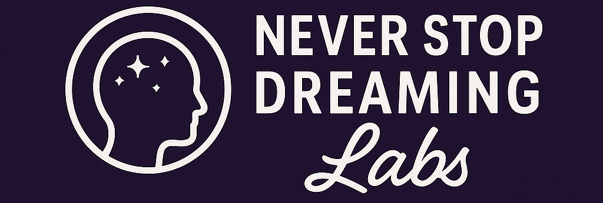

## Un laboratoire pour l’imprévisible.

Never Stop Dreaming Labs naît à contre-courant, dans un monde où la performance relègue souvent la créativité et le rêve au second plan.

Et pourtant, face à l’imprévisible, à l’inconnu, parfois au chaos, nous croyons qu’il est urgent de renouer avec des racines fortes, diverses, multiples.

Nous ne cherchons pas la vitesse, ni la productivité à tout prix.
Nous préférons poser des questions, accueillir des réponses inattendues, et ouvrir le champ des possibles.

Parce que c’est là que naît la vraie robustesse :
dans ce qui prend le temps d’être imaginé, éprouvé, et partagé.

