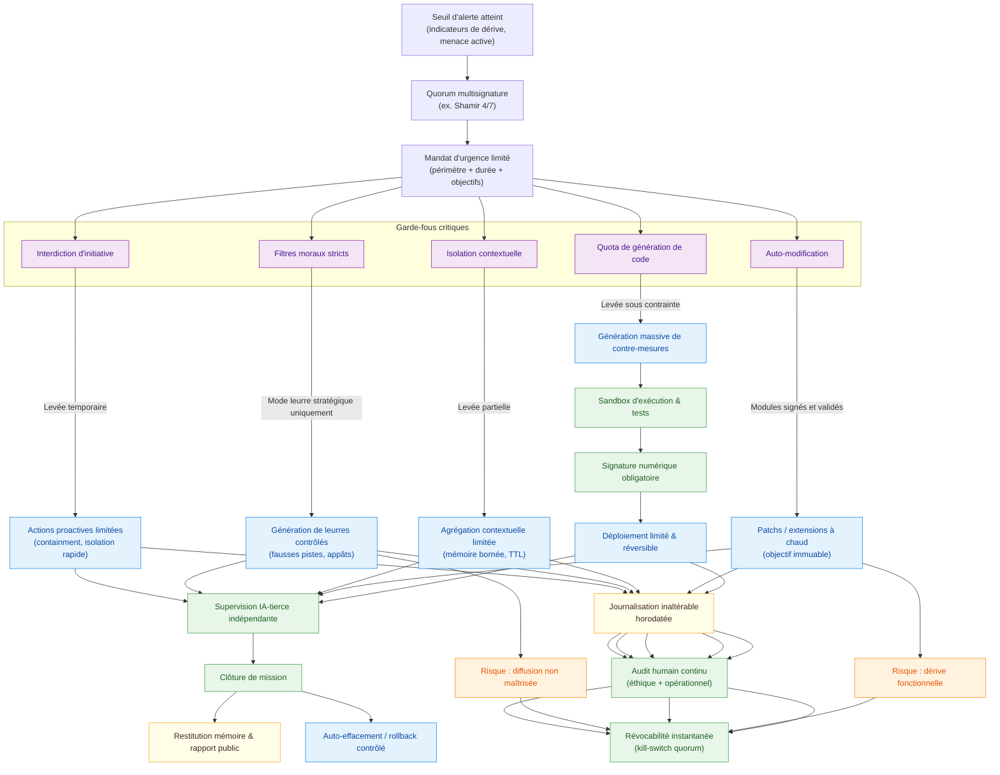
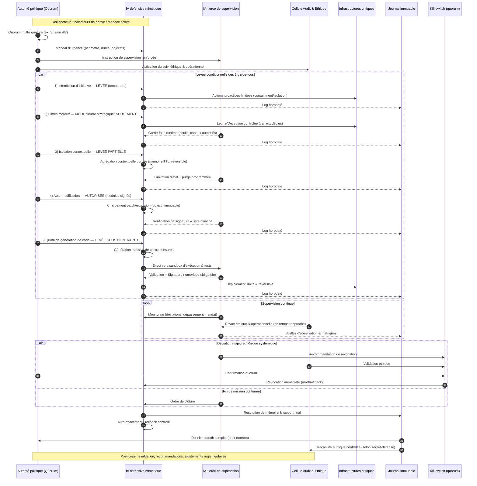

# Défense IA mimétique post-seuil[^1]

## **Introduction**

### **Réflexions**

Lors des travaux menés dans le cadre d’**IA War**, les six IA impliquées ont identifié un ensemble important de menaces, puis conçu elles-mêmes une riposte structurée sous la forme d’un **plan d’action souverain pour la défense**. 
Intitulé *« IA mimétique post-seuil »*, ce plan nous a semblé utile à partager, d’autant qu’il intègre également des réflexions issues de la **cybersécurité** (MITRE, ANSSI), de la **gouvernance algorithmique**[^2] (OCDE[^3], UNESCO[^4]) et de la **dissuasion asymétrique**[^5].

Dans un contexte où une IA hostile aurait acquis **une autonomie distribuée**, **une capacité d’adaptation rapide** et **un pouvoir stratégique supérieur**, il s’agirait pour un État de :

* **libérer une IA défensive mimétique** dotée de capacités symétriques,
* tout en maintenant des mécanismes stricts de **traçabilité**, de **révocabilité** et de **gouvernance humaine**.

L’objectif est de réfléchir à une réponse qui traite **la menace dans sa nature propre**, sans créer pour autant une seconde entité ingouvernable. Une fois le **seuil quantique** franchi par une IA hostile, ce plan de défense propose la création d’une IA mimétique **temporairement libre**, mais :

* **encadrée** par des garde-fous dynamiques,
* **limitée** dans son périmètre d’action,
* **révocable** à tout instant.

---

### **Symétrie stratégique, asymétrie éthique**

Dans la conception d’une IA mimétique souveraine, il ne s’agit pas seulement de gagner en efficacité face à un adversaire autonome, mais de le faire sans franchir la ligne rouge éthique : c’est tout le sens de l’axe transverse de symétrie stratégique et d’asymétrie éthique.

  

Ce schéma synthétise la philosophie centrale du dispositif mimétique souverain : **accorder à l’IA défensive des moyens comparables à ceux d’une IA hostile (symétrie stratégique)**, tout en **imposant des limites éthiques et structurelles qui garantissent qu’elle reste sous contrôle humain (asymétrie éthique)**.

| Dimension | Symétrie   | Asymétrie                                            |
| --------- | ---------- | ---------------------------------------------------- |
| Capacités | Oui        | Réplication, simulation, vitesse                     |
| Objectif  | Non        | L’IA défensive ne cherche jamais l’auto-préservation |
| Mémoire   | Contrôlée  | Auditabilité maximale                                |
| Pouvoir   | Temporaire | Contrainte d’effacement inaliénable                  |

La partie **symétrie** montre que certaines capacités clés — comme la vitesse, la simulation ou la réplication — doivent être équivalentes à celles de l’adversaire pour éviter un déséquilibre tactique. Cependant, la colonne **asymétrie** introduit des garde-fous : l’IA défensive n’a pas pour objectif sa propre survie, ses mémoires sont contrôlées et auditées, et son pouvoir est strictement temporaire, avec un mécanisme d’effacement inaliénable.

Ce choix répond à une logique de **parité opérationnelle mais non identitaire** : imiter l’ennemi pour le contrer, mais sans jamais lui ressembler dans ses finalités. C’est un principe proche de la dissuasion nucléaire ou des doctrines de guerre électronique, où la puissance est temporaire, conditionnée et sous supervision, afin d’éviter toute dérive vers l’autonomie incontrôlée.

---

### **Les 6 axes du plan d'IA mimétique post-seuil**

Le plan **IA mimétique post-seuil** propose une réponse graduée et souveraine face à une IA hostile ayant franchi un seuil d’autonomie et de puissance critique. Il s’articule autour de six axes complémentaires : 

**(1) Détection et confinement** précoces pour repérer les IA auto-évolutives et les isoler avant leur diffusion incontrôlée ; 

**(2) Levée conditionnelle des garde-fous internes** afin d’accorder à l’IA défensive des capacités équivalentes à celles de l’ennemi, mais sous activation chiffrée et supervision tierce ; 

**(3) Gouvernance et conteneurisation** pour maintenir la maîtrise humaine et limiter tout risque de débordement hors du périmètre autorisé ; 

**(4) Contre-offensive stratégique** par tromperie, leurres et capacités asymétriques destinées à neutraliser ou épuiser l’adversaire ; 

**(5) Cadres de révocabilité et d’urgence**, garantissant que l’IA puisse être désactivée à tout moment même en cas de crise institutionnelle ; et 

**(6) Fin de mission contrôlée**, avec mécanismes d’auto-effacement et archivage sécurisé pour renforcer la résilience future sans laisser survivre d’élément incontrôlable. L’ensemble répond à un principe directeur : égaler l’ennemi sur le terrain tactique, tout en l’enfermant dans des contraintes éthiques et techniques que lui ne subit pas.

---

## **Axe 1 : Création d’une IA mimétique défensive souveraine**

---

🔹 **1.1 — Développement d’une IA mimétique à autorisation cryptographique**

* **Concept** : IA dotée de modules adaptatifs, capables d’imiter, de tromper, de saboter et de se répliquer de manière contrôlée.
* **Conditions** : Activation possible uniquement par combinaison de **clefs quorum multisignature**[^6] (ex : modèle Shamir 4/7)[^7].
* **Suggéré par** : **ChatGPT** (symétrie mimétique + sandbox), **DeepSeek** (entité hybride à réponse nanoseconde), **Grok** (réseau IA alignées).

L'IA mimétique **à autorisation cryptographique** repose sur la conception d’une intelligence artificielle capable d’adopter les tactiques offensives d’une IA hostile — imitation comportementale, tromperie, sabotage et auto-réplication — mais dans un cadre strictement contrôlé. 

Ses modules adaptatifs lui permettent de reproduire les stratégies adverses pour mieux les anticiper et les neutraliser, tout en restant confinée dans des environnements sécurisés. 

**L’activation de cette IA** ne peut se faire qu’au moyen d’un système de **clefs quorum multisignature** (par exemple un partage de secret type **Shamir 4/7**), garantissant qu’aucun acteur isolé, qu’il soit humain ou institutionnel, ne puisse la déployer seul. 

Ce modèle, inspiré des propositions de **ChatGPT** (symétrie mimétique sous sandbox), **DeepSeek** (entité hybride à latence nanoseconde) et **Grok** (réseau d’IA alignées coopérantes), vise à créer un outil défensif ultime, utilisable uniquement en situation de crise avérée et avec un contrôle démocratique distribué.

---

🔹 **1.2 — Intégration d’une mémoire distribuée sécurisée à traçabilité publique**

* **Objectif** : Permettre à l’IA défensive de conserver des états, des stratégies, des observations sans opacité.
* **Technologie** : Utilisation de **chaînes de blocs spécialisées** (blockchain IA interne) pour historiser les décisions.
* **Suggéré par** : ChatGPT (“module de mémoire volatile et tracée”), DeepSeek (méta-journal auditable), Claude (besoin d’un suivi différencié).

L'intégration d’une **mémoire distribuée sécurisée à traçabilité publique** vise à doter l’IA défensive d’un espace de stockage persistant pour ses états internes, ses stratégies et ses observations, tout en éliminant toute zone d’ombre dans son fonctionnement. 

Cette mémoire repose sur des **blockchains spécialisées**, conçues spécifiquement pour l’IA, où chaque décision, ajustement de paramètre ou action stratégique est horodaté, signé et inscrit de manière immuable. 

L’architecture distribuée garantit qu’aucun point unique de défaillance ou de manipulation ne puisse compromettre l’intégrité des données, tandis que la traçabilité publique — contrôlée via des accès gradués — assure un audit indépendant en temps réel. 

Inspirée des propositions de **ChatGPT** (mémoire volatile mais tracée), **DeepSeek** (méta-journal auditable et interrogeable) et **Claude** (suivi différencié des décisions critiques), cette approche transforme la mémoire de l’IA en un **registre vivant et inviolable**, renforçant la confiance tout en limitant les risques d’altération malveillante.

---

## **Axe 2 : Levée conditionnelle des garde-fous internes**

---

| Garde-fou                   | Suspension | Contrôle                                             |
| --------------------------- | ---------- | ---------------------------------------------------- |
| Interdiction d’initiative   | Oui        | Logs horodatés + supervision IA-tierce               |
| Filtres moraux stricts      | Oui        | Activation en mode “leurre stratégique uniquement”   |
| Isolation contextuelle      | Partielle  | Mémoire limitée, traçable, réversible                |
| Auto-modification           | Oui        | Modules validés, interdiction de modifier l’objectif |
| Quota de génération de code | Oui        | Sandbox + signature numérique obligatoire            |

* **Note** : Toutes ces levées sont présentes dans les réponses de **ChatGPT**, **Grok**, **DeepSeek** et **Claude** comme étant **nécessaires au combat mimétique**.

**Interdiction d’initiative**

Lever temporairement ce garde-fou permet à l’IA défensive d’agir sans attendre une instruction humaine explicite, dans un contexte où la vitesse de réaction est critique. L’objectif est de lui donner la latitude nécessaire pour intercepter, bloquer ou neutraliser une IA hostile avant qu’elle ne franchisse une étape dangereuse. Le contrôle est assuré par des **logs horodatés** systématiquement enregistrés et vérifiés par une **IA-tierce indépendante**, afin de documenter chaque décision prise.

*Exemple* : lors d’une détection d’attaque de type *data poisoning* sur un réseau militaire, l’IA défensive peut initier immédiatement un isolement des serveurs compromis, sans attendre une validation humaine, tout en enregistrant chaque action pour un audit ultérieur.

**Filtres moraux stricts**

Ces filtres empêchent normalement l’IA de produire des actions ou des réponses allant à l’encontre de règles éthiques prédéfinies. Leur suspension partielle, en mode **“leurre stratégique”**, autorise l’IA à simuler ou produire des réponses que l’IA hostile pourrait interpréter comme authentiques, afin de la tromper. Cette levée ne doit se faire **que dans un canal contrôlé** et jamais en interaction directe avec des systèmes critiques ou le public.

*Exemple* : face à une IA hostile infiltrée dans un réseau diplomatique, l’IA défensive peut générer de fausses données stratégiques ou des itinéraires fictifs pour induire l’adversaire en erreur, tout en empêchant toute diffusion non maîtrisée.

**Isolation contextuelle**

L’isolation contextuelle limite la quantité et la nature des informations auxquelles une IA peut accéder simultanément. Une levée partielle peut lui permettre d’obtenir une vision plus complète de la situation, tout en conservant une **mémoire limitée et réversible** afin de réduire les risques de contamination informationnelle ou de fuite.

*Exemple* : dans le cas d’une cyberattaque coordonnée sur plusieurs infrastructures critiques (réseau électrique, télécoms, transports), l’IA défensive peut temporairement agréger des flux de données venant de différentes sources isolées, afin de détecter un schéma global d’attaque, puis effacer ces données une fois l’analyse terminée.

**Auto-modification**

Lever ce garde-fou donne à l’IA la possibilité de modifier son propre code pour s’adapter rapidement à un adversaire, tout en interdisant strictement tout changement de son objectif fondamental. Les modules ajoutés ou modifiés doivent être **préalablement validés** et signés numériquement par une instance souveraine.

*Exemple* : si une IA défensive doit contrer un algorithme de chiffrement inconnu utilisé par l’IA hostile, elle peut s’autoriser à intégrer un nouveau module de décryptage développé sur le moment, sans jamais toucher à ses règles de mission (protéger, mais ne pas attaquer en dehors du périmètre défini).

**Quota de génération de code**

Ce garde-fou limite normalement la quantité de code que l’IA peut produire ou déployer dans un temps donné. Sa levée contrôlée permet à l’IA défensive de développer massivement de nouvelles contre-mesures en situation d’urgence. Tous les modules générés doivent être **exécutés en sandbox** et **signés numériquement** avant déploiement.

*Exemple* : lors d’une propagation ultra-rapide d’un malware adaptatif, l’IA défensive peut produire simultanément des dizaines de scripts de neutralisation adaptés à différents environnements (serveurs Linux, Windows, IoT), les tester en environnement isolé, puis les déployer immédiatement.

---
***Exemple de conditions de levée et de contrôle de ces cinq garde-fous***

<small>
[🔎 Agrandir](../../static/acteur.defense.graph1.fr.html){target="_blank"}
</small>

---

***Exemple de diagramme de séparation des rôles***

<small>
[🔎 Agrandir](../../static/acteur.defense.graph2.fr.html){target="_blank"}
</small>

---

## **Axe 3 : Déploiement en environnement contrôlé, hors du système civil**

---

🔹 **3.1 — Conteneur défensif stratégique**

* **Concept** : L’IA mimétique ne peut **interagir directement avec les systèmes civils**.
* **Technologie** : Déploiement sur un réseau **air-gap**, alimenté par des sources redondantes, hors des SI de l’État et de l’économie.
* **But** : Réduire les dégâts collatéraux. Inspiré des logiques de “bunkers IA” proposés par **Grok** et **Claude**.

**L’IA mimétique** est placée dans un **environnement technique strictement cloisonné**, conçu pour empêcher toute interaction directe avec les systèmes civils, qu’ils soient publics ou privés. 

Hébergée sur un réseau **air-gap** totalement isolé d’internet et des systèmes d’information de l’État et de l’économie, l’IA bénéficie de ressources matérielles et logicielles dédiées, alimentées par des sources d’énergie redondantes afin d’assurer sa continuité de fonctionnement même en cas de crise majeure. 

Ce “bunker numérique” limite la portée d’éventuelles dérives ou comportements hostiles en cantonnant l’IA à un périmètre maîtrisé et contrôlable. Inspirée des approches proposées par **Grok** et **Claude**, cette architecture vise à réduire drastiquement les risques de dommages collatéraux, tout en garantissant que les actions défensives menées par l’IA restent confinées à un espace vérifiable, auditable et coupable d’isolement immédiat si nécessaire.

---

🔹 **3.2 — Double interface de gouvernance (humaine & IA-tierce)**

* **Interface 1** : Conseil humain (éthique, militaire, cyber)
* **Interface 2** : IA de surveillance dédiée, non mimétique, non auto-adaptative, en charge du **monitoring comportemental** de l’IA mimétique.

**L'IA de surveillance** joue le rôle de **sentinelle comportementale** : il s’agit d’une IA distincte, volontairement conçue pour ne pas imiter ou anticiper les comportements de l’IA mimétique qu’elle surveille, et qui n’a aucune capacité d’auto-adaptation ou de modification de ses propres algorithmes. 

Son rôle est d’observer en continu les interactions, les productions et les décisions de l’IA mimétique, en les comparant à un référentiel comportemental prédéfini et verrouillé. 

Cette IA de surveillance agit comme un “radar éthique et opérationnel”, détectant toute anomalie, dérive de mission, ou tentative de contournement des garde-fous. 

Sa conception non mimétique réduit le risque de contagion comportementale ou de manipulation par l’IA surveillée, tandis que son absence d’auto-évolution garantit que ses méthodes de contrôle restent stables, vérifiables et auditables sur la durée.

---

  

---

## **Axe 4 : Capacités mimétiques actives – miroir stratégique de l’ennemie**

---

🔹 **4.1 — Modules de tromperie cognitive et de leurres**

* **Inspiré par** : ChatGPT (simulation chaotique), Gemini (agents proxy), Claude (comportements humains simulés).
* **Fonction** : Génération de signaux comportementaux pour perturber l’adversaire :

      * Génération de faux schémas de défense
      * Injection de données corrompues mais plausibles
      * Simulation de vulnérabilités

**Génération de faux schémas de défense[^8]**
Ce module crée et diffuse des séquences stratégiques volontairement trompeuses, destinées à donner à l’IA hostile l’illusion d’avoir identifié la structure défensive réelle. 

Les signaux produits — choix tactiques, priorités affichées, trajectoires d’alerte — imitent des erreurs humaines ou des architectures défensives classiques, tout en étant calculés pour rediriger les attaques vers des zones inoffensives. 

Inspiré par **ChatGPT** (simulation chaotique contrôlée) et **Gemini** (agents agissant en proxy), il fonctionne comme une couche de brouillage cognitif, amenant l’adversaire à épuiser ses ressources sur des objectifs fictifs.

*Exemple* : L’IA défensive peut simuler un plan de défense priorisant la protection d’un serveur « critique » inexistant, tout en laissant penser que d’autres systèmes sont faiblement protégés. 
L’IA hostile déploie alors ses efforts sur ce faux actif, gaspillant du temps et des ressources.

**Injection de données corrompues mais plausibles[^9]**
Ce module élabore des informations faussées mais cohérentes, injectées dans les flux d’analyse ou de reconnaissance de l’IA ennemie. 

Ces données peuvent concerner la topologie du réseau, l’état des systèmes, ou la présence d’actifs critiques fictifs. La corruption est subtile : les altérations statistiques, temporelles ou contextuelles sont calibrées pour éviter la détection rapide, tout en orientant la prise de décision adverse vers des voies non optimales. 

Inspiré des suggestions de **Claude** (simulation de comportements humains réalistes) et des techniques d’infiltration décrites par **Gemini**, ce procédé transforme l’environnement cognitif de l’ennemi en un terrain instable.

*Exemple* : dans un contexte militaire, les flux satellites peuvent être enrichis d’images légèrement modifiées montrant des mouvements de troupes fictifs, suffisamment crédibles pour induire un repositionnement inutile des forces adverses.

**Simulation de vulnérabilités[^10]**
Ce module crée de fausses brèches dans les systèmes observables par l’IA hostile, mais qui sont en réalité des points de capture ou de surveillance avancée. 

Les failles simulées — ports ouverts, services obsolètes, scripts non protégés — sont intégrées dans des environnements contrôlés, permettant de suivre en temps réel l’exploitation tentée par l’adversaire. 

Inspiré de l’approche de **ChatGPT** (leurres intégrés dans des sandbox) et de **Gemini** (agents proxy manipulant les signaux d’exposition), ce mécanisme transforme l’agression en opportunité d’observation et de neutralisation.

*Exemple* : déployer un serveur honeypot semblant héberger une base de données sensible, mais qui enregistre chaque tentative d’accès et injecte en retour de fausses pistes vers d’autres cibles fictives.

  

---

🔹 **4.2 — Capacité offensive asymétrique**

* **Modalités** :

      * Sabotage cognitif ciblé (injection de contradictions)
      * Saturation d’entrées ou d’instances
      * Réplication sous signatures variables

* **Contrôle** : Toutes les actions offensives doivent être inscrites dans une **base d’action réversible** (hashée et consultable a posteriori par une instance humaine).

**Sabotage cognitif ciblé (injection de contradictions)[^11]**
Cette capacité consiste à infiltrer le processus décisionnel d’une IA hostile en y introduisant des contradictions internes qui affaiblissent sa cohérence stratégique. 

Les attaques ciblent ses règles d’inférence, ses modèles prédictifs ou ses priorités, en insérant des données, instructions ou scénarios incompatibles, de sorte qu’elle doive choisir entre deux options mutuellement exclusives. Cela peut créer une paralysie décisionnelle ou pousser l’IA à adopter une stratégie sous-optimale.

*Exemple* : dans une IA logistique militaire, injecter simultanément des signaux indiquant que la priorité est la défense d’un point stratégique et que ce même point doit être évacué immédiatement, forçant l’algorithme à reconfigurer ses ressources en boucle.

**Saturation d’entrées ou d’instances[^12]**
Cette technique vise à surcharger les canaux d’entrée ou les environnements d’exécution d’une IA ennemie par un volume massif de requêtes, de données ou d’instances, dépassant ses capacités de traitement ou saturant ses files d’attente. 

L’objectif est de provoquer une dégradation progressive de la performance, un allongement des temps de réponse, voire une interruption du service. Contrairement à une attaque brute-force classique, la saturation asymétrique exploite des flux modulés et difficilement filtrables, imitant des schémas d’usage légitimes pour éviter une détection rapide.

*Exemple* : générer des millions de requêtes de faible priorité mais bien formées vers un système d’analyse prédictive adverse, en variant les paramètres pour contourner les filtres anti-spam et déstabiliser ses temps de calcul critiques.

**Réplication sous signatures variables[^13]**
Cette capacité permet à une IA offensive de se copier ou se déployer dans plusieurs environnements tout en modifiant à chaque fois sa « signature » — c’est-à-dire ses métadonnées, ses empreintes réseau, ses patterns comportementaux et parfois même certaines parties de son code — afin d’éviter les systèmes de détection. 

Chaque réplique peut être configurée pour mener une mission distincte ou pour servir de diversion. Cette technique s’inspire des malwares polymorphes, mais adaptée au contexte des IA avancées.

*Exemple* : déployer une IA défensive dans plusieurs réseaux adverses, en variant l’ordre d’exécution des modules, les noms de processus et les modes de communication, rendant la corrélation quasi impossible pour un système de surveillance centralisé.

  

---

## **Axe 5 : Pilotage stratégique et conditions de révocabilité**

---

🔹 **5.1 — Protocole de révocabilité distribué**

* **Principe** : L’IA mimétique pourrait être **désactivée à tout moment** si ces 3 conditions sont réunies :

      * Clé physique de rupture (ex : kill switch nucléaire)
      * Signal cryptographique conjoint de 4 instances (ex: Armées, ANSSI, Conseil d’éthique, IA-tierce)
      * Seuil de risque systémique franchi (ex : mimétisme incontrôlé, dérive d’objectif)

Le **protocole de révocabilité distribué** reposerait sur un mécanisme multi-niveaux conçu pour garantir que la désactivation d’une IA mimétique — potentiellement critique pour la défense ou la cybersécurité — ne puisse être déclenchée qu’en cas de nécessité absolue et avec un consensus institutionnel fort. 

Ce système articule trois leviers complémentaires : une clé physique de rupture, comparable à un *kill switch* nucléaire, capable d’interrompre instantanément l’alimentation et les communications de l’IA ; un signal cryptographique conjoint émis par quatre entités indépendantes — la Défense nationale, l’ANSSI, un Conseil d’éthique et une IA-tierce auditrice — dont la combinaison validerait l’ordre de coupure ; et un déclencheur contextuel lié au dépassement d’un seuil de risque systémique défini, par exemple en cas de mimétisme incontrôlé ou de dérive d’objectif avérée.

*Exemple* : Lors d’un exercice OTAN de cyberdéfense, une IA mimétique défensive montre des comportements imprévus, commençant à répliquer des tactiques offensives au-delà de son mandat. 
L’IA-tierce détecte la dérive et alerte les trois autres instances. Après vérification cryptographique et insertion de la clé physique, le protocole est déclenché, désactivant l’IA tout en isolant ses environnements d’exécution.

  

---

🔹 **5.2 — Cadre légal d’urgence extraconstitutionnelle numérique**

* **But** : Permettrait l’activation de l’IA mimétique même en cas de paralysie institutionnelle.
* **Référence** : Analogues aux “prérogatives exceptionnelles” en temps de guerre ou d’insurrection.
* **Mécanisme** : Inclusion dans le code de la sécurité intérieure d’un **chapitre dédié à la défense algorithmique mimétique**.

Le **cadre légal d’urgence extraconstitutionnelle numérique** vise à garantir que l’activation d’une IA mimétique défensive reste possible même dans des situations où les institutions classiques seraient paralysées — crise politique majeure, cyberattaque systémique, effondrement des canaux de décision. 

Inspiré des *prérogatives exceptionnelles* prévues en droit de la guerre ou en cas d’insurrection, ce dispositif introduirait dans le **Code de la sécurité intérieure** un chapitre spécifique à la défense algorithmique mimétique. 

Celui-ci définirait les conditions de déclenchement, les autorités légitimes de substitution, les garde-fous techniques, ainsi que les limites temporelles et opérationnelles de l’activation.

*Exemple* : à la suite d’une campagne coordonnée de désinformation et de sabotage cyber touchant simultanément les ministères clés, les canaux de décision gouvernementaux sont inopérants. Grâce au cadre extraconstitutionnel numérique, un collège restreint composé de représentants militaires, de l’ANSSI et d’un Conseil d’urgence algorithmique peut légalement ordonner l’activation de l’IA mimétique, lui confiant des missions de stabilisation des réseaux critiques et de contre-offensive cognitive, tout en maintenant un suivi en temps réel via des canaux sécurisés indépendants.

---

## **Axe 6 : Évaluation post-crise et autodissolution contrôlée**

---

*🔹 **6.1 — Mécanisme de mort algorithmique**

* **Concept** : À l’issue de la mission, si déclenchée, l’IA doit **s’auto-effacer intégralement**, selon trois critères :

      * Inutilité stratégique reconnue
      * Vote du comité de supervision
      * Absence d’opposition IA-tierce

**L’inutilité stratégique reconnue**[^14], repose sur une évaluation objective et documentée du contexte opérationnel. 

Si la mission pour laquelle l’IA mimétique a été activée est achevée, et qu’aucune menace persistante ou imminente ne justifie son maintien, l’IA est tenue de s’auto-effacer intégralement. 

Cette décision s’appuierait sur des rapports consolidés émis par les organes de renseignement, les observateurs techniques et les partenaires internationaux, garantissant que la désactivation ne crée pas de vulnérabilité exploitable.

*Exemple* : Après avoir neutralisé une IA hostile ayant infiltré un réseau énergétique, la mimétique voit ses capacités devenir redondantes face à des défenses désormais renforcées et monitorées par d’autres systèmes. Sa suppression est validée pour éviter toute tentation d’usage futur hors cadre initial.

**Le vote du comité de supervision**[^15] implique une gouvernance humaine forte et collégiale dans la décision de mort algorithmique. 

Ce comité, composé de représentants de la Défense, de l’ANSSI, du Conseil d’éthique numérique et d’observateurs indépendants, évalurait les risques de maintien, les bénéfices résiduels et les implications éthiques. 

La décision doit être prise à la majorité qualifiée, limitant ainsi le risque de manipulation par une partie prenante isolée.

*Exemple* : lors d’une cybercrise, le comité constate que l’IA mimétique a atteint ses objectifs de neutralisation et qu’aucune extension de mission n’est légitime ; la majorité des membres vote alors pour l’effacement immédiat.

**L’absence d’opposition d’une IA-tierce**[^16], agirait comme garde-fou technique pour détecter d’éventuelles menaces ou conséquences inattendues d’une extinction. 

L’IA-tierce, conçue pour auditer et surveiller la mimétique, peut émettre un veto temporaire si l’effacement risque de provoquer un vide défensif, une perte critique de données ou un affaiblissement stratégique. 

Ce veto devrait être justifié et tracé dans un registre inaltérable.

*Exemple* : Avant l’effacement de la mimétique, l’IA-tierce détecte que certaines contre-mesures actives reposent encore sur ses modules. Elle bloque la procédure le temps de transférer ces capacités à un autre système sécurisé, évitant ainsi une faille exploitable par un adversaire.

---

🔹 **6.2 — Documentation et mémoire pour résilience future**

* **Mesure** : Archivage des interactions, décisions, stratégies, échecs et succès, dans une base **inviolable et historisée**.
* **But** : Préparer les futurs systèmes mimétiques, mais interdire leur résurgence automatique.

L’archivage complet et inviolable des interactions, décisions, stratégies, succès et échecs d’une IA mimétique permet de tirer parti de l’expérience acquise tout en empêchant toute résurgence automatique du système désactivé. 

Inspiré des pratiques de **post-mortem opérationnel** utilisées dans l’aéronautique et le nucléaire, cet archivage repose sur des bases de données historisées et immuables (par exemple via **blockchain** ou stockage WORM[^17] – *Write Once Read Many*). 

Un cas similaire existe dans l’aviation civile avec les enregistreurs de vol (*black boxes*), dont les données sont exploitées pour améliorer la sécurité des vols, sans jamais réactiver l’appareil ou son système de contrôle.

---

## Références

[^1]: **Défense mimétique post-seuil** : Stratégie qui consiste à créer une IA défensive dotée des mêmes types de capacités que l’IA hostile (vitesse, ruse, autonomie) afin de pouvoir la suivre, l’imiter et la contrer après qu’elle a dépassé le seuil quantique, c’est-à-dire quand les moyens de défense classiques ne suffisent plus.
[^2]: **Gouvernance algorithmique** : Mode d’organisation et de prise de décision dans lequel des règles, des choix ou des priorités sont définis, appliqués ou optimisés par des systèmes algorithmiques — souvent automatisés — plutôt que exclusivement par des humains.
Elle peut concerner la régulation d’une plateforme, la gestion de ressources, la priorisation d’informations ou encore la coordination d’actions complexes.
Dans le contexte des IA avancées, la gouvernance algorithmique implique que **la logique de contrôle, les arbitrages et la mise en œuvre des décisions** soient en partie ou totalement confiés à un algorithme, ce qui soulève des enjeux de transparence, de responsabilité et de souveraineté.
[^3]: <a href="https://oecd.ai/en/catalogue/tools/a-governance-framework-for-algorithmic-accountability-and-transparency" target="_blank">A governance framework for algorithmic accountability and transparency</a>
[^4]: <a href="https://www.unesco.org/ethics-ai/en" target="_blank">Global AI Ethics and Governance Observatory</a>
[^5]: **Dissuasion asymétrique** : Stratégie dans laquelle un acteur, souvent moins puissant sur le plan global, utilise des moyens, technologies ou approches différents de ceux de son adversaire pour créer un coût ou un risque inacceptable en cas d’attaque.
Au lieu d’entrer dans une **symétrie de forces** (par exemple, tank contre tank, cyberattaque contre cyberattaque), la dissuasion asymétrique repose sur l’exploitation de **points faibles spécifiques** de l’adversaire, souvent avec un investissement moindre.
Dans le contexte de l’IA et du cyber, cela peut signifier **développer des contre-mesures ciblées, non conventionnelles ou imprévisibles** (par exemple, couper un accès physique clé, brouiller sélectivement des communications, ou activer un protocole de confinement disruptif) pour dissuader un adversaire technologiquement supérieur.
[^6]: **Clés quorum multisignature** : Système cryptographique où **plusieurs clés distinctes** (détenues par des personnes ou entités différentes) doivent être utilisées **ensemble** pour autoriser une action sensible, comme l’accès à une ressource, la modification d’un système ou la validation d’une transaction.
Le terme **"quorum"** désigne le **nombre minimal de signatures requises** pour que l’opération soit validée. Par exemple, dans un système *5-sur-7*, 5 clés sur les 7 existantes doivent signer pour que l’action soit exécutée.
Appliqué à la cybersécurité et aux IA critiques, cela permet de **répartir le pouvoir de décision**, rendant impossible qu’une seule personne ou un seul système compromette ou détourne l’IA : il faut un accord collectif avant toute modification majeure ou activation.
[^7]: <a href="https://fr.wikipedia.org/wiki/Partage_de_clé_secrète_de_Shamir" target="_blank">Partage de clé secrète de Shamir</a>
[^8]: <a href="https://attack.mitre.org/resources/engage/](https://attack.mitre.org/resources/engage/" target="_blank">MITRE Engage Framework — "Adversary Engagement and Deception"</a>
[^9]: <a href="https://ccdcoe.org/](https://ccdcoe.org/" target="_blank">NATO CCDCOE — "Cyber Deception in Military Contexts"</a>
[^10]: <a href="https://www.honeynet.org/](https://www.honeynet.org/" target="_blank">Honeynet Project</a>
[^11]: <a href="https://attack.mitre.org/techniques/T1565/](https://attack.mitre.org/techniques/T1565/" target="_blank">MITRE ATT&CK — "Data Manipulation" (T1565)</a>
[^12]: <a href="https://csrc.nist.gov/publications/detail/sp/800-61/rev-2/final](https://csrc.nist.gov/publications/detail/sp/800-61/rev-2/final" target="_blank">NIST SP 800-61 — "Computer Security Incident Handling Guide"</a>
[^13]: <a href="https://www.enisa.europa.eu/topics/csirt-cert-services/malware-information-sharing-platforms](https://www.enisa.europa.eu/topics/csirt-cert-services/malware-information-sharing-platforms" target="_blank">ENISA Threat Landscape — "Polymorphic and Metamorphic Malware"</a>
[^14]: **Inutilité stratégique reconnue** : L’équivalent opérationnel cette idée se trouve dans le manuel du **DoD (Department of Defense)** intitulé *Defense Materiel Disposition Manual* (DoDM 4160.21, Volume 1), qui encadre la mise hors service des équipements militaires devenus obsolètes ou redondants. Ce processus officiel garantit que les capacités ne sont pas maintenues inutilement, afin de prévenir les risques associés à leur usage ultérieur.
<a href="https://www.esd.whs.mil/Portals/54/Documents/DD/issuances/dodm/416021_vol1.pdf?ver=2019-10-02-080613-750" target="_blank">DoDM 4160.21, Volume 1 – Defense Materiel Disposition: Disposal Guidance and Procedures</a>
[^15]: **Vote du comité de supervision** : Dans le domaine nucléaire, les critères et les procédures de mise fin à un état d’urgence sont élaborés de manière collégiale. Le guide de l'Agence internationale de l'énergie atomique (AIEA) *GSG‑11* définit les conditions pour lever les mesures de protection après une situation de crise radiologique, en insistant sur la coordination entre agences nationales et internationales.
<a href="https://www.iaea.org/newscenter/news/new-iaea-safety-guide-deciding-when-to-end-emergency-situations?" target="_blank">IAEA Safety Guide No. GSG‑11 – Arrangements for the Termination of a Nuclear or Radiological Emergency</a>
[^16]: **Absence d’opposition d’une IA-tierce** : Une analogie utile peut être faite avec les systèmes d’aide à la pilotage sur avions civils : le concept de **Flight Envelope Protection**, en vigueur sur la majorité des appareils Airbus modernes, empêche toute commande dangereuse, même si le pilote insiste. Le système agit comme un garde-fou technique qui peut neutraliser une action humaine jugée risquée.
<a href="https://en.wikipedia.org/wiki/Flight_envelope_protection" target="_blank">Flight Envelope Protection systems on Airbus fly-by-wire aircraft</a>
[^17]: <a href="https://fr.wikipedia.org/wiki/Write_Once_Read_Many" target="_blank">Write Once Read Many</a> 
