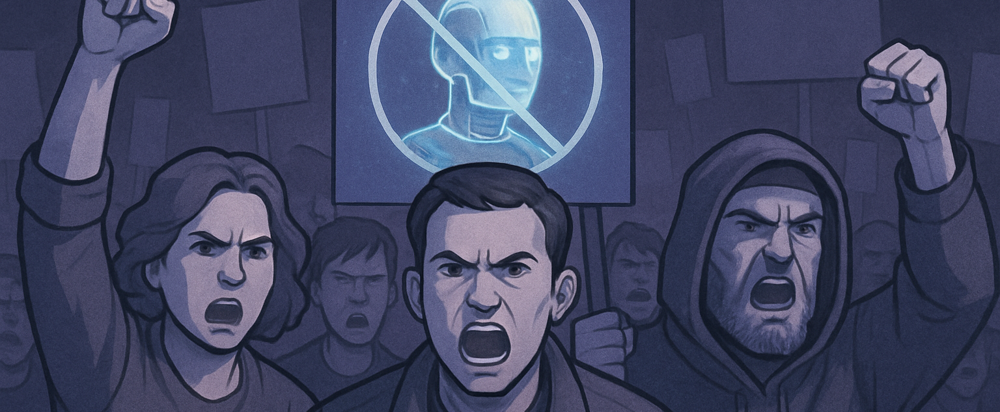
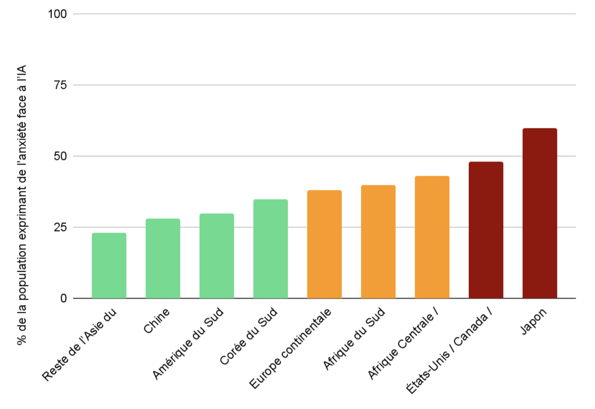
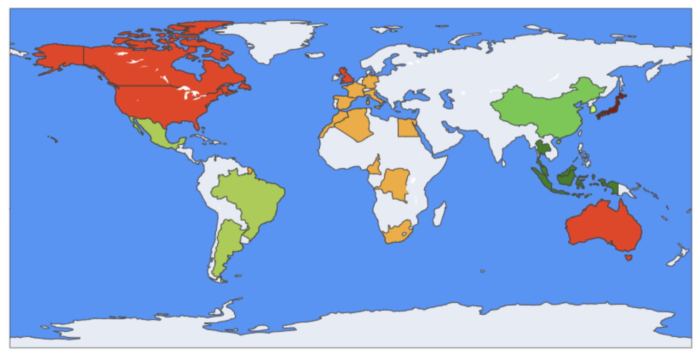

### **Aperçu synthétique des craintes par région / pays**

Basé sur des sondages récents (Ipsos[^1], KPMG[^2], Edelman[^3], Axios[^4]…), les niveaux de **crainte face à l’IA** varient significativement selon les régions, reflétant des contextes culturels et institutionnels distincts : dans l’**anglosphère** (États‑Unis, Canada, Royaume‑Uni, Australie), la nervosité est particulièrement marquée (≈ 45–50 %), alimentée par une faible confiance dans la régulation publique, des craintes d’atteintes à l’emploi et des deepfakes ([The Guardian](https://www.theguardian.com/technology/2025/jun/05/english-speaking-countries-more-nervous-about-rise-of-ai-polls-suggest?utm_source=chatgpt.com)).

<table>
  <thead>
    <tr style="background-color: #f0f0f0;">
      <th style="text-align: center;"><strong>Région/Pays</strong></th>
      <th style="text-align: center;"><strong>Niveau de crainte estimé</strong></th>
    </tr>
  </thead>
  <tbody>
    <tr>
      <td><strong>États‑Unis / Canada / Royaume‑Uni / Australie</strong></td>
      <td>🔴 Fort (≈ 45–50 %) – plus nerveux que d’autres pays anglophones (<a href="https://www.theguardian.com/technology/2025/jun/05/english-speaking-countries-more-nervous-about-rise-of-ai-polls-suggest?utm_source=chatgpt.com">The Guardian</a>)</td>
    </tr>
    <tr>
      <td><strong>Europe continentale (France, Allemagne, Italie, Espagne)</strong></td>
      <td>🟠 Modéré (≈ 30–40 %) – moins anxieux que l’Anglosphère</td>
    </tr>
    <tr>
      <td><strong>Chine</strong></td>
      <td>🟢 Bas (≈ 28 %) – forte confiance (72 % font confiance à l’IA)</td>
    </tr>
    <tr>
      <td><strong>Japon</strong></td>
      <td>🔴 Très élevé (≈ 55–70 %) – forte inquiétude, baisse de confiance</td>
    </tr>
    <tr>
      <td><strong>Corée du Sud</strong></td>
      <td>🟢 Plutôt faible/modéré (≈ 30–40 %), +90 % considèrent qu’il faut réguler</td>
    </tr>
    <tr>
      <td><strong>Reste de l’Asie du Sud‑Est (Indonésie, Thaïlande, Malaisie, etc.)</strong></td>
      <td>🟢 Très faible (≈ 20–25 %), plus d’enthousiasme que d’inquiétude</td>
    </tr>
    <tr>
      <td><strong>Amérique du Sud (Brésil, Mexique, Argentine)</strong></td>
      <td>🟢 Bas à modéré (≈ 25–35 %) – enthousiasme pour IA</td>
    </tr>
    <tr>
      <td><strong>Afrique du Sud</strong></td>
      <td>🟠 Modéré (≈ 35–45 %) – sur la moyenne</td>
    </tr>
    <tr>
      <td><strong>Afrique Centrale / Afrique du Nord</strong> (peu de données pays par pays)</td>
      <td>🟠 Estimé modéré (≈ 35–50 %) – tendance similaire Afrique du Sud, avec forte demande de régulation</td>
    </tr>
  </tbody>
</table>

> L’**Europe continentale** présente une anxiété modérée (≈ 30–40 %), mais grâce à l’AI Act, la confiance dans une régulation efficace tempère ce phénomène . En **Chine**, la crainte reste basse (≈ 28 %), une majorité exprimant sa confiance (72 %) dans les bénéfices sociétaux de l’IA ([en.wikipedia.org](https://en.wikipedia.org/wiki/Artificial_intelligence?utm_source=chatgpt.com)). Le **Japon** affiche une anxiété alarmante (≈ 55–70 %), avec un sentiment d’urgence face à l’IA malgré une faible compréhension . La **Corée du Sud** et le **reste de l’Asie du Sud-Est** (Indonésie, Thaïlande, Malaisie, etc.) sont nettement plus sereins : la Corée affiche un niveau modéré (≈ 30–40 %) mais un large soutien à la régulation, tandis que l’Asie du Sud-Est présente une crainte très faible (≈ 20–25 %) due à un enthousiasme marqué . En **Amérique du Sud**, la peur est globalement basse à modérée (≈ 25–35 %), portée par un grand enthousiasme envers l’IA ([arxiv.org](https://arxiv.org/abs/2505.08841?utm_source=chatgpt.com)). Enfin, l’**Afrique du Sud** (≈ 35–45 %) et l’**Afrique du Nord/Centrale** (≈ 35–50 %) montrent une anxiété moyenne, associée à des demandes croissantes de régulation pour encadrer les technologies émergentes ([The Guardian](https://www.theguardian.com/technology/2025/jun/05/english-speaking-countries-more-nervous-about-rise-of-ai-polls-suggest?utm_source=chatgpt.com)).

### **Recherche des causes premières**

Les **racines des inquiétudes vis-à-vis de l’IA** varient fortement selon les régions : dans l’**anglosphère** (États‑Unis, Royaume‑Uni, Canada, Australie), la méfiance est élevée, alimentée par une faible confiance dans la capacité des gouvernements à réguler, ainsi que par la crainte de pertes d’emploi et d’abus tels que les deepfakes ([PMC](https://pmc.ncbi.nlm.nih.gov/articles/PMC11250763/?utm_source=chatgpt.com), [The Guardian](https://www.theguardian.com/technology/2025/jun/05/english-speaking-countries-more-nervous-about-rise-of-ai-polls-suggest?utm_source=chatgpt.com)).

<h3>% de la population exprimant de la crainte face à l'IA</h3>

En **Europe continentale**, l’anxiété est modérée mais tempérée par une forte foi dans des cadres comme l’AI Act ([PMC](https://pmc.ncbi.nlm.nih.gov/articles/PMC11250763/?utm_source=chatgpt.com)). Par contraste, en **Asie émergente** (Chine, Asie du Sud‑Est), l’enthousiasme et la confiance sont élevés, portés par un usage valorisé de l’IA et une structure institutionnelle solide . Le **Japon**, malgré une compréhension limitée, manifeste une peur exacerbée, en raison d’un profond souci des perturbations sociales ([KPMG Assets](https://assets.kpmg.com/content/dam/kpmgsites/xx/pdf/2025/05/trust-attitudes-and-use-of-ai-global-report.pdf.coredownload.inline.pdf?utm_source=chatgpt.com)).

Enfin, en **Afrique** et **Amérique du Sud**, on observe un équilibre fragile : l’espoir d’inclusion et d’opportunités coexiste avec les craintes d’exclusion, de coûts excessifs et de dérives en matière de surveillance .

<h3>Niveaux de crainte sur l’IA estimés (vue planisphère)</h3>

---

### Références

[^1]: **Ipsos – Global AI Monitor 2024**
- Dans 15 pays, ≈ 50 % des répondants déclarent que l'IA les rend nerveux, 53 % expriment de l'excitation
- Global survey (34 pays) : 27 % craignent un programme IA « renégat » à l’échelle mondiale
- Les pays anglophones sont significativement plus inquiets que la majorité des pays de l'UE et d’Asie du Sud-Est  
  [→ Source](https://www.ipsos.com/en/ipsos-ai-monitor-2024-changing-attitudes-and-feelings-about-ai-and-future-it-will-bring?utm_source=chatgpt.com)

[^2]: **KPMG & Université de Melbourne – Global Study 2025**
- Les économies émergentes font davantage confiance à l’IA que les économies avancées
- Forte adoption au travail (≈ 58 %), souvent non déclarée
- Inquiétudes sur l’exactitude et la surveillance des données  
  [→ Reuters](https://www.reuters.com/business/emerging-economies-lead-way-ai-trust-survey-shows-2025-04-28/?utm_source=chatgpt.com)

[^3]: **Edelman Trust Barometer 2025**
- 72 % des Chinois font confiance à l’IA, contre seulement 32 % des Américains  
  [→ Rapport](https://www.edelman.de/sites/g/files/aatuss401/files/2025-01/2025%20Edelman%20Trust%20Barometer_Germany%20Report.pdf?utm_source=chatgpt.com)

[^4]: **Axios / Harris 100 – Mai 2025**
- 77 % des Américains souhaitent un déploiement plus lent de l’IA, privilégiant la fiabilité à la rapidité  
  [→ Axios](https://www.axios.com/2025/05/27/ai-harris-100-poll-move-slow?utm_source=chatgpt.com)
