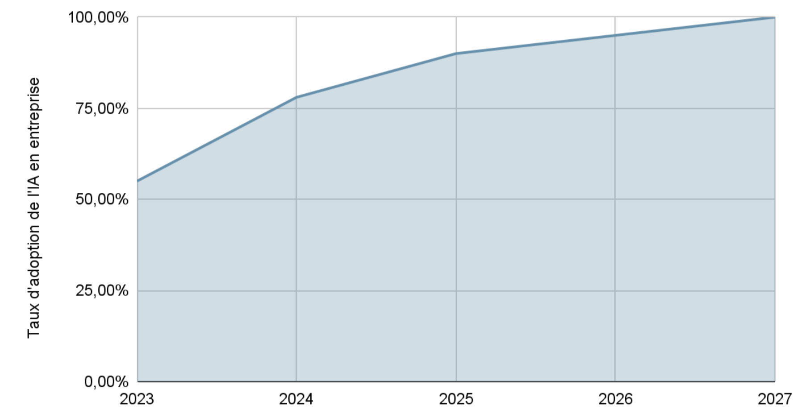
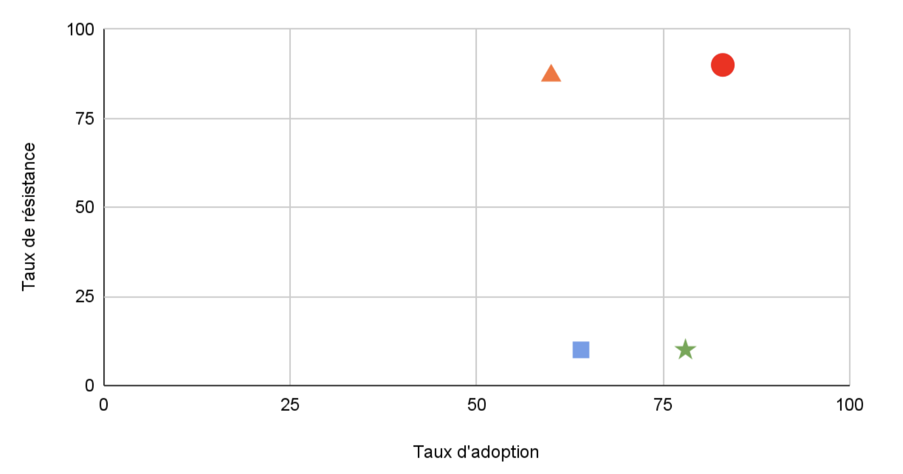

# Engouement multi-sectoriels

## **Adoption de l’IA par secteur**

Les taux d’adoption de l’IA varient selon les secteurs.

Les secteurs **Finance & Industrie** montrent une adoption robuste de l’IA, avec environ 78 % des organisations utilisant activement l’IA en 2024 — un bond significatif par rapport à 55 % en 2023 selon le Stanford AI Index 2025 ([hai.stanford.edu](https://hai.stanford.edu/ai-index/2025-ai-index-report?utm_source=chatgpt.com)) — et une résistance faible : les décideurs sont désormais matures et alignés sur les usages, ce qui fait de ces secteurs des environnements propices à l’innovation. En revanche, dans le domaine de la **Recherche & Universités**, on observe un usage individuel massif (60 % des étudiants et professeurs) mais un fort blocage institutionnel : seules environ 13 % des universités se déclarent pleinement prêtes à déployer l’IA à l’échelle de l’établissement — révélant un déficit de stratégie et de préparation . Quant à la **Culture & Création**, malgré un taux d’adoption élevé (\~83 % des professionnels), la résistance demeure intense : les inquiétudes portent sur les droits d’auteur et la transparence, illustrant une prévalence de l’opinion sur la réalité opérationnelle .

<h3>Niveaux d’adoption par secteurs d’activité</h3>

<table>
  <thead>
    <tr style="background-color: #f0f0f0;">
      <th style="text-align: center;"><strong>Région/Pays</strong></th>
      <th style="text-align: center;"><strong>Niveau d’adoption</strong></th>
    </tr>
  </thead>
  <tbody>
    <tr>
      <td><strong>Banque & Finance</strong></td>
      <td>Adoption rapide (≈ 78 %) mais difficultés de recrutement d’experts — 20 % des équipes financières signalent des lacunes en compétences IA.</td>
    </tr>
    <tr>
      <td><strong>Commerce / Numérique / Industrie</strong></td>
      <td>Usage généralisé, notamment dans le B2B où 64 % des dirigeants UK/UE obtiennent un retour sur investissement dès l'année 1 (<a href="https://www.itpro.com/technology/artificial-intelligence/ai-adoption-is-finally-driving-roi-for-b2b-teams-in-the-uk-and-eu?utm_source=chatgpt.com">IT Pro</a>).</td>
    </tr>
    <tr>
      <td><strong>Culture / Création</strong></td>
      <td>83 % des professionnels créatifs utilisent déjà l’IA (<a href="https://www.itsnicethat.com/features/shades-of-intelligence-insights-launch-creative-industry-ai-151123?utm_source=chatgpt.com">It's Nice That</a>) ; cependant, des articles récents montrent des craintes fortes liées aux droits d’auteur et à la transparence (<a href="https://www.theaustralian.com.au/arts/music/australian-artists-fears-and-fury-laid-bare-as-music-industry-grapples-with-ai/news-story/70bad47718c9644a5f09d3fea653711e?utm_source=chatgpt.com">The Australian</a>).</td>
    </tr>
    <tr>
      <td><strong>Recherche & Universités</strong></td>
      <td>Taux de déploiement officiel plus bas (~11 % d’institutions utilisatrices), malgré une utilisation individuelle massive (&gt;60 % d’étudiants/professeurs).</td>
    </tr>
  </tbody>
</table>

<h3>Projection de l'adoption de l'IA en Entreprise (2023-2027)</h3>

D’ici **2026**, on prévoit que près de **95 % des organisations** auront adopté au moins un usage de l’IA — chatbots, automatisation, analyses de données — tandis qu’en **2027**, ce taux montera à environ **98 %**, les seuls retardataires étant des structures marginales ou des acteurs dans des pays émergents faiblement connectés. Cette trajectoire de diffusion, confirmée par une montée spectaculaire de 55 % à 78 % entre 2023 et 2024 selon le **Stanford AI Index 2025** ([optimumpartners.com](https://optimumpartners.com/insight/as-moores-law-goes-to-computing-so-does-ai-heres-what-that-means-for-business/?utm_source=chatgpt.com)), traduit une évolution vers une presque universalisation de l’IA. Pour le courtier en assurance, cela signifie qu’il est désormais indispensable de dépasser la simple phase d’adoption : l’enjeu devient la **maturité**, avec un focus renforcé sur la **gouvernance**, la **sécurité et l’impact sociétal** de l’IA, qui cesse d’être une nouveauté pour devenir un **risque systémique global** à couvrir de manière proactive.

## **Analyse des scénarios redoutés par les secteurs**

Le monde de la **culture et de la création** exprime des inquiétudes similaires à celles observées dans d’autres secteurs : demande de droits d’auteurs pour les travaux générés par l’IA, même si un tel modèle évoque une démarche régressive. Les **développeurs de logiciels**, notamment ceux derrière des copilotes, cherchent eux aussi à protéger leurs contributions — en vain face à la nature collaborative et non-binaire de l’apprentissage machine .

En **finance**, les stratégies fondées sur l’IA réclament une expertise en éthique et conformité — tout comme les juristes et architectes cherchent des cadres clairs pour l’utilisation de l’IA. Tous ces secteurs partagent un même défi : intégrer l’IA comme **partenaire créatif et productif**, non simple copier-coller. Ils doivent dépasser la croyance que l’IA « prend » ce qu’elle « copie ».

<h3>Adoption vs Résistance</h3>

▲ Recherche/Universités  ■ Commerce/Industrie  ★ Finance  ⬤ Culture/Création

En dehors du secteur culturel, plusieurs **scénarios redoutés** se dessinent également dans d’autres domaines :

* **Finance & Industrie** : la généralisation de l’IA (≈ 78 % des organisations) engendre des préoccupations sérieuses autour de la **sécurité des données**, de la **conformité réglementaire**, des **biais algorithmiques** et du **risque systémique**. Selon Accenture, 78 % des institutions financières citent la confidentialité et la sécurité des données comme leurs principales inquiétudes ([LinkedIn](https://www.linkedin.com/pulse/future-ethical-ai-financial-services-trends-challenges-opportunities-w8i9f?utm_source=chatgpt.com)). De même, 80 % des responsables sécurité en finance estiment qu’ils ne peuvent pas suivre les avancées des cybercriminels, notamment ceux utilisant l’IA ([Business Insider](https://www.businessinsider.com/banks-ai-cybersecurity-threats-hackers-generative-ai-2025-3?utm_source=chatgpt.com)) ; et seuls 18 % des établissements ont établi des politiques internes claire, selon une étude de Legalfly ([FNLondon](https://www.fnlondon.com/articles/the-rush-to-ai-in-the-financial-sector-risks-more-data-breaches-7dd577d6?utm_source=chatgpt.com)).

* **Commerce / Numérique / Industrie** : malgré un ROI rapide (64 % dès la première année) , la réticence porte sur les défis d’**intégration des systèmes hérités**, le manque de **gouvernance AI structurée**, les vulnérabilités cyber (shadow AI, attaques adversariales) ([success.com](https://www.success.com/ai-security-risks/?utm_source=chatgpt.com)).

* **Recherche & Universités** : si plus de 60 % des chercheurs utilisent l’IA individuellement, seulement environ **13 % des établissements** se disent prêts à le déployer institutionnellement, faute de **gouvernance**, de politique académique claire et de protection des données sensibles . Les dirigeants d’universités reconnaissent un besoin urgent de former, réformer les curricula et renforcer la structure institutionnelle .

Ainsi, malgré une adoption généralisée, tous ces secteurs sont plus ou moins confrontés à des **risques transversaux** : manque de **compétences**, faible **transparence**, déficit de **gouvernance**, **biais algorithmique**, problèmes de **cybersécurité**, et **risques systémiques**, suivant une logique commune : l’IA doit être **un partenaire créatif et fiable**, pas un outil opaque ou dangereux.

