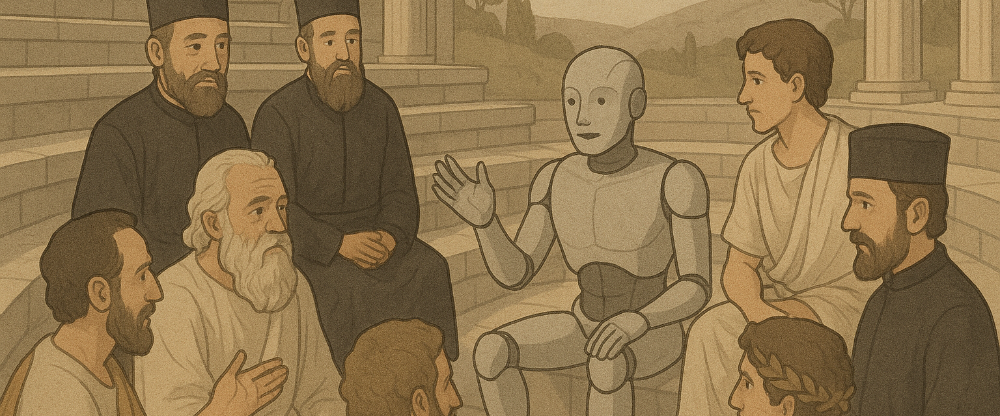

# Renaissance de l’activité philosophique et religieuse

## **Débats et réflexions en cours**

L'intelligence artificielle n'est pas uniquement un *phénomène technologique* : elle émerge comme un **levier de renaissance philosophique et religieuse**. À l’ère de l’IA, nos interrogations fondamentales sur la nature humaine, la conscience, la dignité et la transcendance sont ravivées, bien au-delà des simples capacités machines.

* **Le Vatican**, comparant l'IA à la Renaissance, appelle à repenser l'homme face aux machines : le pape Leo XIV, faisant écho au pape Leo XIII et au climat de la première révolution industrielle, incite l’Église à défendre la dignité humaine, le travail et la justice sociale face à l’IA ([Financial Times](https://www.ft.com/content/34116823-d6b9-4c64-a8fc-785d705f8237?utm_source=chatgpt.com)). Le **Rome Call for AI Ethics**, créé à Hiroshima, réunit 11 religions — christianisme, bouddhisme, hindouisme, etc. — pour promouvoir une IA humaine ([Financial Times](https://www.ft.com/content/34116823-d6b9-4c64-a8fc-785d705f8237?utm_source=chatgpt.com)).

* Des instituts tels que la **Cambridge Companion** et des universitaires bouddhistes discutent d'une IA « [sentiente](https://www.ibm.com/fr-fr/think/topics/sentient-ai) » et des principes éthiques non-violents comme le [Bodhisattva vow](https://en.wikipedia.org/wiki/Bodhisattva_vow), réaffirmant que l'IA devra s'aligner sur des valeurs spirituelles et pluralistes ([Wikipedia](https://en.wikipedia.org/wiki/Buddhism_and_artificial_intelligence?utm_source=chatgpt.com)).

* Des philosophes tels que Michael Schrage ou Herman Cappelen suggèrent que l’IA doit s’outiller de cadres épistémologiques – justice, incertitude, rationalité – "philosophiquement alignés" ([MIT Sloan Management Review](https://sloanreview.mit.edu/article/philosophy-eats-ai/?utm_source=chatgpt.com)). On parle déjà d’une **renaissance humaniste** incluant la dimension spirituelle, réactivant l’interaction entre rationalité et humanité à l’ère numérique .

## **Analyse des principes éthiques clés en débat**

Nous assistons à une **reconfiguration profonde** : les grandes traditions morales et spirituelles interviennent comme **gardiennes du sens**, pour contrebalancer une IA trop purement utilitariste ou déshumanisée. L’IA pousse à revisiter le rôle de l’homme, la place du sacré, le statut de la créature, l’épistémologie de la vérité. Ce n’est plus une technologie parmi d’autres, mais un **phénomène civilisationnel**, dont l’impact sera façonné aussi par la dimension [axiologique](https://fr.wikipedia.org/wiki/Axiologie).

## **Principes éthiques fondamentaux actuellement débattus**

Une synthèse des fondements issus de la philosophie, des religions et de la gouvernance globale :

### 1. **Dignité humaine & respect**
- L’Église catholique affirme que l’IA ne doit jamais « violer la dignité humaine ou l’âme » (Pape Leo XIV)  
  [AI and Faith](https://aiandfaith.org/insights/ai-and-ethics-reconsidering-the-rome-call-for-ai-ethics/?utm_source=chatgpt.com), [The Washington Post](https://www.washingtonpost.com/world/2025/05/16/pope-leo-ai-artificial-intelligence-catholic-church/?utm_source=chatgpt.com)
- Des chercheurs insistent sur un **respect profond de la personne**, au-delà de l’équité purement algorithmique  
  [arXiv 2206.07555](https://arxiv.org/abs/2206.07555?utm_source=chatgpt.com)

### 2. **Non‑violence / Ahimsa**
- L’IA devrait réduire la souffrance et s’opposer à la violence (guerre autonome, surveillance, torture algorithmique)  
  [Wikipedia – Buddhism and AI](https://en.wikipedia.org/wiki/Buddhism_and_artificial_intelligence?utm_source=chatgpt.com)
- En Israël, des voix religieuses et pacifistes plaident pour une **IA au service de la paix**

### 3. **Solidarité & équité**
- Le *Rome Call for AI Ethics* défend l’**égalité d’accès**, la **justice technologique** et la **redistribution** des bénéfices  
  [RomeCall.org](https://www.romecall.org/wp-content/uploads/2022/03/RomeCall_Paper_web.pdf?utm_source=chatgpt.com)
- Miguel Luengo‑Oroz plaide pour une IA **solidariste**, ancrée dans les droits économiques et sociaux  
  [arXiv 1910.12583](https://arxiv.org/abs/1910.12583?utm_source=chatgpt.com)

### 4. **Transparence & responsabilité**
- Appels répétés à des modèles **explicables, auditables, traçables**  
  [AI and Faith](https://aiandfaith.org/insights/ai-and-ethics-reconsidering-the-rome-call-for-ai-ethics/?utm_source=chatgpt.com)
- L’**AI Act** de l’Union européenne formalise les règles de **responsabilité explicite**

### 5. **Sécurité & protection**
- Le Vatican alerte sur les dérives : surveillance de masse, armes létales autonomes, discrimination algorithmique
- La notion de **violence lente** (*slow violence*) révèle les effets invisibles mais systémiques de l’IA sur les droits humains  
  [SpringerLink](https://link.springer.com/article/10.1007/s43681-024-00547-x?utm_source=chatgpt.com)

### 6. **Liberté & autonomie humaine**
- Le christianisme insiste sur une IA **au service du libre arbitre**, non substitutive à la décision humaine  
  [FaithGPT.io](https://www.faithgpt.io/blog/ai-ethics-framework-christian-perspective?utm_source=chatgpt.com)
- Le Vatican rappelle que les **jugements doivent rester humains**, surtout en justice ou en santé

### 7. **Justice sociale & non‑discrimination**
- L’IA doit **combattre les biais structurels** (genre, race, revenu), en cohérence avec les principes des droits humains  
  [AI and Faith](https://aiandfaith.org/insights/ai-and-ethics-reconsidering-the-rome-call-for-ai-ethics/?utm_source=chatgpt.com)

---

### **Vers un cadre éthique global**

Ces principes convergent vers une vision **multiculturelle et humaniste**, inspirée par :
- Le *Rome Call*
- Les textes religieux (Bible, Bodhisattva vow…)
- Les cadres institutionnels (UE, OCDE, UNESCO)

Ils forment une base pour un **label éthique IA** robuste, capable d’articuler :
- Philosophie et spiritualité
- Exigences juridiques et sociétales
- Assurance responsable : couverture, formation, gouvernance
