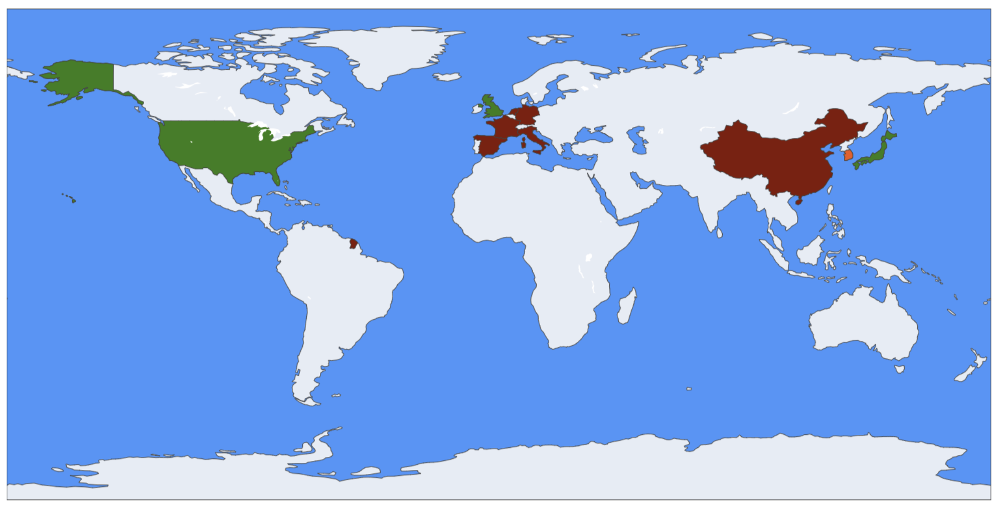

## **Objectifs intrinsèques de la régulation**

Au cœur de la régulation de l'IA réside l’objectif de **protéger** les citoyens, garantir la **sécurité**, préserver les **droits fondamentaux**, assurer la **transparence des décisions algorithmiques**, et prévenir les dérives (biométrie, surveillance de masse, biais discriminatoires) ([bakom.admin.ch](https://www.bakom.admin.ch/dam/bakom/en/dokumente/KI/analyse_laender.pdf.download.pdf/Analysis%20of%20countries%20and%20regions%20around%20the%20world.pdf?utm_source=chatgpt.com)).

* **Anglosphère (US, UK, Canada, Australie)** : les législateurs adoptent un cadre pragmatique et fédérale (US Executive Orders, Data Use & Access Act 2025 au Royaume‑Uni ([Norton Rose Fulbright](https://www.nortonrosefulbright.com/en-us/knowledge/publications/555fa096/ai-update?utm_source=chatgpt.com))), visant à protéger la vie privée et prévenir les discriminations tout en stimulant l’innovation.

* **Europe continentale** : AI Act en vigueur depuis août 2024, fixe un cadre strict (interdictions de surveillance biométrique, obligation de transparence, audits, sanctions pouvant atteindre 7 % du chiffre d’affaires) ([xenoss.io](https://xenoss.io/blog/asia-pacific-apac-ai-regulations?utm_source=chatgpt.com), [Digital Strategy EU](https://digital-strategy.ec.europa.eu/en/policies/regulatory-framework-ai?utm_source=chatgpt.com)). Une feuille de route claire : protéger les droits et favoriser la confiance citoyenne.

* **Asie émergente** : La Chine impose un régime autoritaire (inscription obligatoire, labellisation, contrôles de contenus ([Future of Privacy Forum](https://fpf.org/blog/understanding-japans-ai-promotion-act-an-innovation-first-blueprint-for-ai-regulation/?utm_source=chatgpt.com))), la Corée du Sud déploie une loi nationale cadre applicable dès 2026 , le Japon suit une voie prudente, éthique et volontaire .

<h3>Intensité des cadres régulateurs IA par pays (2024–2025)</h3>

## **Analyse des réglementations clés**

### ***Anglosphère (US, UK, Canada, Australie)***

**Régulation fragmentée, grands risques identifiés**

- Les préoccupations majeures concernent la **vie privée**, les **biais algorithmiques**, les **deepfakes** et le **risque systémique**, dans un contexte d'absence de cadre fédéral harmonisé.  
  → En 2025, plus de **550 projets de loi** ont été proposés aux États-Unis, chacun ciblant ces risques de manière isolée ([Inside Global Tech](https://www.insideglobaltech.com/2024/04/26/overview-of-ai-regulatory-landscape-in-apac/?utm_source=chatgpt.com), [Financial Times](https://www.ft.com/content/ce688a00-c306-414f-8f4f-c20092ee9770?utm_source=chatgpt.com)).

- Les **deepfakes** représentent une menace croissante : **80 % des fraudes liées à l’IA** en 2023 les ont utilisés.

- L’absence d’un cadre uniforme crée un **vide réglementaire** : incohérences entre États, insécurité juridique, et risques réputationnels pour les entreprises.

---

### ***Europe continentale***

**Régulation centralisée et priorisation des droits fondamentaux**

- L’**AI Act** (en vigueur depuis août 2024) définit un cadre rigoureux :
    - Interdiction des systèmes à « **risque inacceptable** » (biométrie, scoring social…).
    - Obligations renforcées pour les **usages à haut risque** (santé, éducation, recrutement…).
    - Auditabilité, transparence, et **amendes jusqu’à 7 %** du chiffre d’affaires global ([xenoss.io](https://xenoss.io/blog/ai-regulations-european-union?utm_source=chatgpt.com)).

- L’UE privilégie la **sécurité juridique** et l’**équité pour les consommateurs**, via des organes comme **l’EIOPA** (assurance) ou **l’EDPB** (données personnelles).

- Objectif : **favoriser une innovation responsable dans un cadre protecteur**.

---

### ***Asie émergente (Chine, Corée, Japon…)***

**Approche variée : de l’autoritaire au progressif**

- **Chine** :
    - Contrôle très strict : **enregistrement des modèles**, **filtrage des contenus**, **étiquetage obligatoire des deepfakes**, **audits préalables**.
    - Objectif : **souveraineté technologique et sécurité idéologique** ([arXiv](https://arxiv.org/abs/2112.04359?utm_source=chatgpt.com)).

- **Corée du Sud** :
    - **AI Framework Act** adopté en janvier 2025, effectif en 2026.
    - Approche « risk-based » ciblant les domaines critiques (énergie, santé, éducation…) ([Future of Privacy Forum](https://fpf.org/blog/south-koreas-new-ai-framework-act-a-balancing-act-between-innovation-and-regulation/?utm_source=chatgpt.com)).

- **Japon** :
    - Stratégie basée sur l’éthique, par **lignes directrices sectorielles volontaires**.
    - Accent sur la **fiabilité technique**, la **protection des données**, avec des **labels étatiques**.

---

### ***Priorités réglementaires par zones***

Ce panorama met en évidence une **fragmentation géopolitique des approches réglementaires** :

| Zone géographique | Approche dominante | Objectifs principaux |
|------------------|--------------------|-----------------------|
| **Europe** | Régulation centralisée | Droits fondamentaux, transparence, contrôle a priori |
| **Anglosphère** | Régulation fragmentée | Cyberrisques, deepfakes, responsabilité algorithmique |
| **Chine** | Contrôle étatique autoritaire | Souveraineté, sécurité idéologique |
| **Corée du Sud** | Régulation ciblée par secteur | Innovation encadrée, sécurité nationale |
| **Japon** | Soft law & éthique | Confiance, autorégulation, fiabilité technique |

> Cette diversité de philosophies réglementaires génère une **tension croissante** entre :
> - **Liberté d’innovation**
> - **Efficacité des contrôles**
> - **Protection des droits**
>
