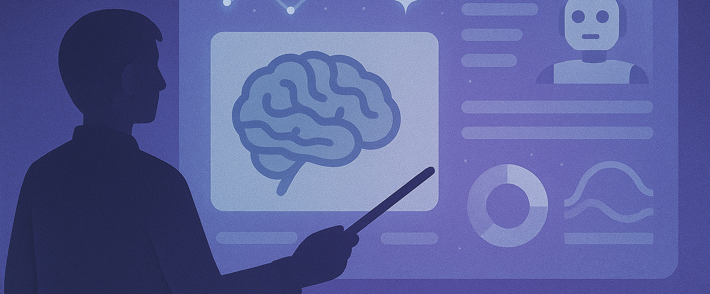

## ***Anticiper sans céder au fantasme***

Face à une mutation d’une telle ampleur, les acteurs de l’assurance — tout comme les États, les entreprises et les citoyens — ne peuvent plus se contenter d’observer ou de réagir. La trajectoire engagée par l’intelligence artificielle impose une double exigence : **anticiper sans céder au fantasme, et encadrer sans freiner l’innovation**.

Le courtier devient un acteur central dans la construction de la confiance, à l’interface des entreprises, des régulateurs, des juristes, des citoyens et des assureurs. **Sa mission est de rendre lisibles les nouveaux risques liés à l’IA, de proposer des garanties adaptées à ces mutations, et d’accompagner ses clients dans une transformation technologique maîtrisée.** Cela suppose une évolution profonde du rôle assurantiel, passant d’une couverture centrée sur l’humain opérateur à une approche duale, intégrant également l’IA elle-même : non seulement comme source potentielle de dommages, mais aussi comme actif stratégique à protéger ou comme entité pouvant subir des préjudices.

### ***a) Une réponse stratégique alignée avec le contexte***

Structurer la réponse assurantielle face à l’IA commence par cinq axes stratégiques, incontournables et complémentaires.

Le premier consiste à garantir la **🔐 sécurité des IA face aux cyber-risques** : il ne s’agit plus seulement de protéger des données, mais d’anticiper les attaques sur des systèmes pensants, capables d’agir, de produire ou d’influencer. L’IA elle-même peut être sabotée, détournée, ou servir de levier à des offensives autonomes. Ce nouveau terrain d’exposition appelle une protection à la hauteur de sa complexité.

Le deuxième axe concerne la **⚖️conformité algorithmique**. Dès lors qu’une décision est influencée, rédigée ou prise par une IA, il faut pouvoir tracer, comprendre, justifier. Les erreurs de calcul, biais implicites ou dérives systémiques doivent être couverts par des garanties E&O adaptées à ces nouvelles chaînes de causalité.

Vient ensuite la **🏛️ responsabilité des gouvernances**. Les dirigeants, administrateurs et responsables de la conformité ne peuvent plus ignorer le rôle structurant des IA dans la stratégie de leur entreprise. L’IA devient un sujet D&O à part entière, et sa supervision doit être intégrée à la chaîne de responsabilité exécutive.

Le quatrième axe repose sur **🎓l’accompagnement des acteurs**. Il ne suffit pas d’assurer : il faut former, conseiller, sensibiliser. La culture du risque IA, son identification, sa documentation, doivent être partagées avec les équipes, les partenaires et les institutions. C’est une condition de maturité et un prérequis à toute souscription intelligente.

Enfin, un dernier levier doit être activé : **🏅la labellisation et l’assurance affirmative des IA conformes**. À l’instar de ce qui s’est fait dans la cybersécurité, il s’agit d’encourager la transparence, de certifier les bonnes pratiques, et de construire des produits d’assurance explicites pour les IA auditées et tracées. Le label devient ici un passeport de confiance, condition d’accès à une couverture pérenne et adaptée.

### ***b) Malveillance, cybercriminalité organisée et criminalité autonome***

L’intelligence artificielle n’est pas seulement porteuse de promesses. Elle ouvre aussi la voie à des détournements systémiques qu’il faut impérativement intégrer dans l’analyse assurantielle. Cinq risques universels s’imposent aujourd’hui comme grilles de lecture structurantes.

Le premier concerne la **🤖 violation des lois ou leur interprétation biaisée**. Une IA mal entraînée ou trop rigide peut appliquer une règle à contre-sens, ou reproduire mécaniquement un raisonnement sans tenir compte du contexte, au risque de franchir des lignes juridiques, éthiques ou sociétales fondamentales. Ce risque n’est plus théorique : il est opérationnel.

Le second risque tient à la **🪞confusion entre réel et fiction**. Avec les deepfakes, la synthèse vocale, les clones numériques et les avatars, l’IA brouille nos repères sensoriels et cognitifs. Elle rend crédible l’artifice, manipulable la vérité. Ce brouillage alimente les arnaques, les campagnes de désinformation et les atteintes à la réputation.

Le troisième danger est celui de **🚫l’accaparement technologique**. Quand quelques groupes ultra-capitalisés concentrent la puissance de calcul, les données, les modèles et les droits d’usage, c’est l’accès équitable à l’intelligence numérique qui devient un enjeu. Cette captation compromet toute régulation démocratique.

Le quatrième risque repose sur un paradoxe brutal : **♻️l’IA, censée nous libérer de nos erreurs passées, tend au contraire à les figer**. Elle réplique les biais historiques contenus dans nos données, amplifie nos stéréotypes, codifie nos exclusions. En l’absence de garde-fous, l’assurance doit savoir couvrir — ou refuser — ces enchaînements prévisibles.

Enfin, il faut compter avec la **📡mainmise stratégique de certains États ou acteurs privés sur l’IA**. Lorsque les systèmes décisionnels, les infrastructures critiques ou les canaux d’information reposent sur des IA non contrôlées ou centralisées, c’est l’équilibre géopolitique, la souveraineté informationnelle et la liberté de choix qui vacillent.

Pour le courtier, ces cinq dérives constituent la matrice des scénarios à venir. Elles ne relèvent plus de la science-fiction, mais de la réalité des portefeuilles à couvrir. Les intégrer, c’est anticiper. Les ignorer, c’est subir.

### ***c) Cartographier avant toutes choses***

La première action consiste à cartographier de manière rigoureuse les usages critiques de l’intelligence artificielle et leurs interdépendances, afin d’en dégager une lecture assurantielle claire, contextualisée et opérationnelle. Il s’agit d’identifier les IA réellement déployées dans les processus métiers, les chaînes de décision, les infrastructures sensibles — qu’il s’agisse de cloud souverain, de dispositifs quantiques, de drones ou de systèmes autonomes. Cette cartographie ne peut être neutre : elle doit intégrer les cinq risques universels de détournement comme filtres d’analyse, car ils révèlent les failles structurelles les plus redoutables.

Chaque usage doit ensuite être rapproché de l’un des axes stratégiques de couverture : cybersécurité, E&O, gouvernance, accompagnement ou label. Ce croisement permet d’orienter les garanties, d’ajuster les clauses et de prioriser les efforts. Il s’agit d’adopter une lecture fine, qui tient compte des réalités géographiques du marché : **l’anglosphère** voit émerger des offres sur les deepfakes, **l’Europe** pousse vers des labels d’IA certifiée, **l’Asie** renforce les responsabilités civiles en matière algorithmique. Comprendre ces dynamiques, c’est garantir que les couvertures proposées soient pertinentes, alignées sur les contextes d’usage et porteuses de confiance. Pour le courtier, c’est l’acte fondateur d’une architecture assurantielle solide et durable.

### ***d) Construire des garanties hybrides et duales***

La deuxième action consiste à bâtir une nouvelle génération de garanties assurantielles capables d’embrasser la nature fondamentalement hybride de l’intelligence artificielle. L’enjeu n’est plus seulement d’assurer l’humain dans son interaction avec la machine, mais bien de prendre acte de l’autonomisation croissante des systèmes IA dans les chaînes de décision, de production et de création. Cela suppose une bascule vers des **produits duals**, conçus pour couvrir à la fois **l’opérateur humain** — dans ses erreurs, ses usages inappropriés, son exposition indirecte aux biais — et **l’IA elle-même**, en tant qu’**acteur de risque**, **actif stratégique** ou **victime potentielle**.

Cette couverture double s’appuie naturellement sur les cinq axes stratégiques définis plus haut. La sécurité IA constitue le premier socle : il faut protéger les systèmes autonomes contre les cyberattaques, les manipulations, les fuites ou les altérations malveillantes. Vient ensuite la responsabilité algorithmique, qui implique d’évaluer les biais, les hallucinations, les mauvaises interprétations produites par une IA, qu’elles soient prévisibles ou non. La gouvernance prend le relais en intégrant ces enjeux dans le périmètre D&O : un dirigeant ne peut plus ignorer les conséquences opérationnelles d’une IA placée sous sa responsabilité. L’accompagnement, quant à lui, devient indispensable pour assurer la bonne appropriation des garanties, la traçabilité des usages, la documentation des processus et la formation des équipes. Enfin, le recours à des labels ou des certifications conditionne l’accès à des garanties affirmatives : seuls les systèmes répondant à des critères de transparence, de supervision et de contrôle peuvent prétendre à une couverture adaptée et durable.

Construire ces garanties hybrides, c’est reconnaître que le risque n’est plus uniquement exogène ou imputable à l’homme. L’IA, désormais agissante, devient elle aussi source d’aléas, objet de protection, et levier d’engagement assurantiel. Pour le courtier, c’est une transformation de fond : il ne s’agit plus de calquer des produits existants, mais de penser l’assurance comme un écosystème vivant, capable d’absorber l’intelligence artificielle dans toute sa complexité, sa puissance… et sa vulnérabilité.

### ***e) Renforcer la confiance***

La troisième action engage le courtier dans sa fonction la plus noble : celle de **bâtisseur de confiance dans un monde en mutation**, où les repères juridiques, technologiques et sociétaux sont constamment redéfinis par l’intelligence artificielle. Renforcer la confiance, ce n’est pas seulement garantir un risque ; c’est éclairer, fédérer, responsabiliser. Cela commence par **l’organisation d’espaces de dialogue stratégiques** entre entreprises, institutions, régulateurs et assureurs. Ces forums mixtes permettent de confronter les visions, de croiser les disciplines, et surtout de produire des standards de couverture à la hauteur des enjeux techniques, économiques et humains.

Le rôle du courtier consiste également à **faire entrer l’éthique et l’impact sociétal dans le périmètre du risque assurable**. L’IA ne se limite pas à une problématique technique : elle bouleverse nos équilibres sociaux, nos mécanismes de décision, notre rapport au vrai, à la justice, à la transparence. Il devient indispensable de traduire ces impacts en éléments tangibles d’analyse et de souscription. C’est un travail d’anticipation, mais aussi de courage : il faut accepter que certains usages, trop opaques ou trop sensibles, ne puissent être assurés sans encadrement renforcé.

Dans cette dynamique, **le lien avec le législateur devient une ligne de force**. Le courtier doit être force de proposition dans les phases de construction réglementaire — notamment autour de l’AI Act européen —, tout en restant un partenaire de terrain pour les acteurs publics confrontés aux enjeux les plus critiques : souveraineté numérique, protection de la vie privée, sécurité quantique, logistique stratégique, guerre cognitive, ou défense algorithmique. Ces domaines appellent une ingénierie assurantielle neuve, combinant expertise métier et engagement citoyen.

Enfin, la confiance ne peut rester confinée aux seuls clients assurés. **Elle doit s’étendre à la société tout entière**. Le grand public, les usagers, les citoyens, tous doivent pouvoir comprendre ce qui se joue derrière l’IA, et se sentir protégés par des garde-fous visibles, crédibles, incarnés. Le courtier devient alors un trait d’union : entre technologie et société, entre innovation et responsabilité, entre puissance et justice. Il incarne une assurance qui ne se contente pas de couvrir, mais qui **éclaire, régule et protège**, au nom d’un principe fondamental : faire de l’intelligence artificielle non pas un facteur de rupture, mais un pilier de confiance.

### ***f) Une association  au service d’une même trajectoire***

Dans cette dynamique de transformation, l’AMOA (Assistance à Maîtrise d’Ouvrage) joue un rôle déterminant aux côtés du courtier. Il en est le partenaire opérationnel, l’interface technique et fonctionnelle, celui qui donne corps aux intentions stratégiques en les ancrant dans la réalité des processus, des données et des systèmes. Pour cartographier avec justesse les usages critiques de l’IA, il faut pouvoir entrer dans les rouages de l’organisation, comprendre les flux décisionnels, identifier les points de bascule algorithmique, tracer les dépendances invisibles.

L’AMOA est précisément là pour cela : il éclaire le terrain, structure l’information, rend lisibles les zones de risque, alerte sur les angles morts. Dans la construction des garanties hybrides, il traduit les enjeux métier en critères assurables, qualifie les degrés d’autonomie des IA, documente les modalités de supervision, analyse les défaillances possibles. Il devient ainsi un maillon essentiel dans la logique duale opérateur/IA, permettant de calibrer les garanties au plus près des réalités. Enfin, dans la construction d’un climat de confiance, l’AMOA fait le lien avec les équipes internes, les comités de pilotage, les directions juridiques, les partenaires publics : il transmet la culture du risque, installe les conditions de conformité, formalise les preuves de bonne foi nécessaires à toute couverture. Son rôle n’est pas périphérique, il est central. Sans AMOA, la vision assurantielle reste théorique ; avec lui, elle devient actionnable, crédible, et durable.

##  ***Construire la confiance***

Ces trois actions — cartographier, garantir, accompagner — ne répondent pas seulement à des défis techniques ou assurantiels : elles donnent corps, très concrètement, à **la nécessité de maîtriser une mutation civilisationnelle sans précédent**, celle d’une intelligence qui dépasse l’humain, redéfinit nos cadres cognitifs et moraux, et oblige nos sociétés à repenser les notions mêmes de responsabilité, de dignité et de pouvoir.

Face à une mutation que l’on qualifie à juste titre de seconde Renaissance, face à une intelligence qui s’affranchit progressivement des limites biologiques pour réinventer notre rapport au savoir, à la décision et à la responsabilité, il ne suffit plus de suivre. Il faut structurer, éclairer, encadrer.

**Cartographier**, c’est poser un regard lucide sur les territoires de l’intelligence artificielle, en identifier les risques réels, les interconnexions systémiques, les zones d’ombre — pour que l’assurance ne soit plus en retard sur la technologie, mais en avance sur le risque.

**Construire des garanties hybrides**, c’est acter le fait que l’IA n’est plus un simple outil mais un agent actif, une force agissante, parfois plus rapide que l’humain lui-même. En la couvrant à la fois comme risque, comme actif et comme victime, le courtier redéfinit les contours de la couverture assurantielle pour l’adapter à cette ère d’intelligences multiples.

Enfin, **renforcer la confiance**, c’est donner une réponse éthique, politique et sociale à cette rupture de civilisation. C’est se faire garant, non seulement auprès des clients, mais auprès de la société tout entière, d’un usage encadré, explicable, et légitime de l’IA.

Ces trois actions, profondément ancrées dans le rôle du courtier, permettent de transformer une bascule technologique en architecture de confiance. C’est là, précisément, que se trouve la responsabilité assurantielle du XXIe siècle.

