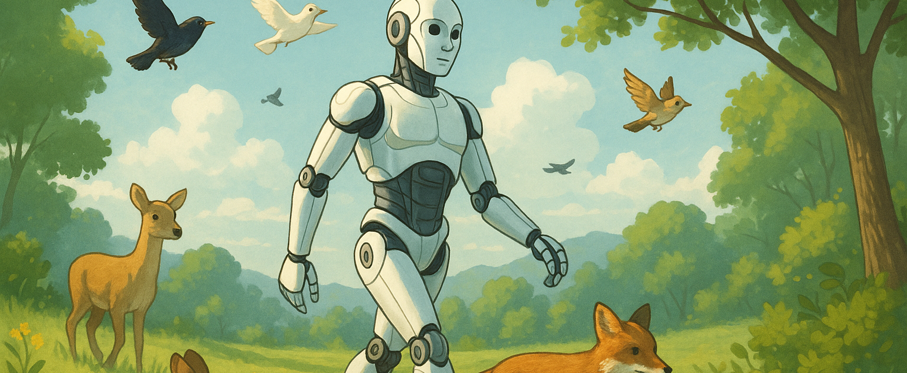

# Vers l’émergence des androïdes : un monde physique animé par l’IA

## **Introduction : des intelligences logicielles aux corps autonomes**

Nous ne parlons plus d’avenir, mais bien d’un présent en transformation rapide. Depuis 2023, les démonstrateurs humanoïdes s’accélèrent et changent de statut. Ce que la robotique expérimentait depuis des décennies dans les laboratoires devient aujourd’hui une industrie naissante. L’émergence des IA génératives a agi comme un catalyseur puissant : en dotant les machines d’une forme d’autonomie cognitive, elle les rend enfin compatibles avec des corps. Le monde de l’intelligence, longtemps cantonné au virtuel, amorce désormais son ancrage dans le monde physique. Les androïdes ne sont plus un fantasme de science-fiction : ils représentent la prochaine vague d’intégration de l’IA, avec des implications techniques, économiques, éthiques et assurantielles majeures.

Ce basculement s’inscrit dans une trajectoire technologique longue. La mécatronique — cette discipline hybride qui associe mécanique, électronique et contrôle informatique — existe depuis les années 1960, avec les premières chaînes robotisées (notamment chez General Motors, FANUC ou KUKA). Mais ces systèmes, s’ils exécutaient des gestes précis, étaient totalement dénués d’intelligence adaptative. C’est au tournant des années 2010 que la convergence s’amorce véritablement, avec l’apparition des premiers cobots (robots collaboratifs) capables de partager un espace avec l’humain, de réagir à son comportement, et de moduler leurs gestes. Cette robotique dite « sensible » pose les bases de ce qui deviendra, dix ans plus tard, l’écosystème des androïdes.

L’année 2023 marque un jalon. Tesla présente son robot Optimus, conçu pour un usage industriel généraliste. Agility Robotics déploie Digit dans les entrepôts logistiques d’Amazon. Figure s’associe à OpenAI pour injecter du langage naturel dans des corps humanoïdes. Ces signaux convergents traduisent un fait clair : la maturité conjointe de l’IA (notamment les grands modèles de langage) et de la robotique fait émerger un nouveau type d’acteur — autonome, mobile, interactif — appelé à cohabiter avec les humains dans des espaces réels. C’est un changement de paradigme. L’agent logiciel devient agent corporel. Le risque abstrait devient risque physique. Et l’assurance ne peut rester figée dans des modèles du XXe siècle.

Pour les assureurs et les courtiers, cette convergence impose une lecture nouvelle. On ne couvre plus seulement des données, des systèmes informatiques ou des erreurs d’algorithme : on couvre des corps mécaniques, parfois humanoïdes, animés par des systèmes décisionnels complexes. Cette hybridation du risque — à la fois cybernétique, physique, opérationnelle et morale — fait éclater les catégories traditionnelles. Dès aujourd’hui, des entreprises engagent des projets pilotes avec des robots mobiles dans les entrepôts, les hôpitaux ou les gares. Et demain, ces robots prendront forme humaine, dialogueront, apprendront en continu, et interagiront avec des personnes vulnérables. Le régime de responsabilité change, les obligations de sécurité changent, les scénarios d’incident changent. Le champ de l’assurance doit suivre, ou mieux : anticiper.

Le moment d’agir est maintenant, car **le point de bascule technologique est atteint.** Il est éclairé par des publications majeures telles que le rapport « *The Global AI Index 2024* » (Tortoise Media), qui signale une **hausse de 160 % des investissements privés en robotique humanoïde couplée à des IA** depuis 2021, ou encore les études du MIT CSAIL et de l’ETH Zurich qui confirment la convergence technique entre perception temps réel, locomotion autonome et dialogue IA embarqué. Le champ est ouvert, les premiers cas d’usage réels sont en cours. Pour le courtier comme pour l’assureur, il ne s’agit plus de comprendre si les androïdes arrivent — mais à quelle vitesse, sous quelle forme, et à quels risques concrets il faudra répondre.

---

## **Définitions et distinctions essentielles**

Comprendre les distinctions qui structurent l’univers robotique est essentiel pour anticiper les risques et bâtir des garanties pertinentes. Tous les robots ne se valent pas, et l’usage abusif du mot « IA » ne doit pas masquer la réalité mécanique et fonctionnelle de ces systèmes. L’assurance ne peut se contenter de couvrir un objet technique : elle doit cerner précisément ce qu’il fait, comment il décide, avec quel niveau d’autonomie et dans quel environnement. Or, cette autonomie prend aujourd’hui des formes variées, du bras articulé en usine au robot humanoïde capable d’interagir verbalement avec un patient âgé.

Le **cobot**, ou robot collaboratif, est sans doute la forme la plus industrialisée de cette cohabitation homme-machine. Conçu pour travailler aux côtés des humains dans des environnements partagés, il ne vise pas l’autonomie, mais l’assistance. Il obéit, ajuste ses gestes en fonction de la force ou de la position de son partenaire humain, et se limite à un ensemble de tâches bien définies. C’est un outil perfectionné, programmable, souvent intégré dans les chaînes de production (voir les modèles Universal Robots ou FANUC CRX). Ce type de robot soulève des enjeux assurantiels proches de ceux de la machine-outil, mais commence à poser des questions inédites dès lors qu’il est doté de capteurs de perception ou d’algorithmes adaptatifs. Qui est responsable si le cobot écrase une main ? Le fabricant ? L’intégrateur ? L’entreprise utilisatrice ?

À l’autre extrémité du spectre, l’**androïde** concentre à lui seul une part symbolique et technique forte : **forme humanoïde**, mobilité articulée, dialogue, perception de l’environnement, apprentissage. L’androïde n’est pas un simple automate déguisé : il tend vers une autonomie fonctionnelle complète, dans un corps capable d’interagir de façon fluide avec le monde humain. Il est le fruit de la **convergence entre la robotique avancée, l’IA embarquée et les systèmes temps réel.** Il peut manipuler des objets, dialoguer, comprendre une scène, faire des choix dans un environnement semi-structuré. L’exemple de Figure AI, qui combine des LLM avec un robot humanoïde mobile, illustre cette mutation. On ne parle plus d’exécution, mais de décision. Cela change tout.

Entre les deux, le champ des **robots autonomes** recouvre une large palette de dispositifs. Certains sont mobiles, mais non humanoïdes : drones, robots quadrupèdes, chariots autonomes. D’autres sont stationnaires, mais dotés d’un niveau de décision local. Tous partagent une capacité à percevoir, traiter et agir sans supervision humaine constante. Leur diversité rend le risque difficile à catégoriser : un drone logistique en entrepôt n’expose pas aux mêmes dangers qu’un robot militaire autonome ou un robot médical assistant à domicile. Pourtant, tous ces systèmes relèvent d’une même tendance : le transfert partiel ou total de la décision à la machine.

Un point de vigilance essentiel réside dans la distinction entre la machine elle-même et l’intelligence qui l’anime. Beaucoup de robots restent encore dépendants d’une **IA déportée**, opérant dans le cloud. Ils reçoivent les ordres d’un serveur central, traitent les données à distance, réagissent selon des modèles prédictifs issus du machine learning. À l’inverse, d’autres sont dotés d’une **IA embarquée**, logée dans leur cœur électronique (NVIDIA Jetson, Qualcomm RB5…). Cette différence n’est pas anecdotique : elle détermine leur latence, leur autonomie réelle, leur exposition aux coupures réseau, mais aussi leur surface d’attaque en cybersécurité. Un système hybride, combinant **edge AI et cloud AI**, devient la norme dans les projets avancés. Il autorise une réactivité locale tout en bénéficiant d’une mémoire globale. Mais il complexifie la chaîne de responsabilité.

Ce paysage technique en évolution rapide impose une cartographie fine des typologies de robots, de leurs niveaux d’autonomie et des architectures cognitives sous-jacentes. Pour l’assureur comme pour le régulateur, il ne s’agit plus seulement de couvrir un outil ou un employé augmenté : il faut désormais comprendre un acteur algorithmique capable d’agir, de percevoir, de se tromper — et parfois d’apprendre. C’est là que le risque se déplace, et que naissent de nouvelles responsabilités.

---

## **Rétrospective des pionniers du secteur**

L’histoire des androïdes ne commence ni avec les IA génératives, ni avec les grands modèles de langage. Elle plonge ses racines dans l’univers de la **robotique industrielle**, né au tournant des années 1960 avec l’automatisation des chaînes de montage. Le premier robot programmable, **Unimate**, développé par George Devol et Joseph Engelberger, est déployé dès 1961 dans une usine General Motors. Son rôle est purement mécanique : déplacer des pièces métalliques brûlantes. Mais cet acte fondateur marque l’entrée de la machine programmable dans le monde industriel, avec des enjeux de sécurité déjà critiques — à l’époque, des barrières physiques séparaient systématiquement l’humain du robot.

Dans les années 1980–1990, l’Europe et le Japon prennent une avance significative dans le domaine de la mécatronique, avec l’essor des grands fabricants comme **KUKA**, **FANUC**, **ABB** et **Yaskawa**. Les robots sont puissants, rapides, mais aveugles : leur intelligence reste rudimentaire. Il faudra attendre le début des années 2000 pour voir émerger une nouvelle ambition, celle de **robots autonomes, sensibles, collaboratifs**. C’est dans ce contexte qu’apparaît **Honda ASIMO**, en 2000, véritable prouesse d’équilibre dynamique bipède, capable de monter des escaliers, courir, porter des objets. En parallèle, le Japon explore une voie plus sociale avec les premiers humanoïdes expressifs, conçus non pas pour porter des charges, mais pour établir une relation avec l’humain.

C’est cette ambition que reprend **Aldebaran Robotics**, fondée en 2005 à Paris par Bruno Maisonnier. Avec **Nao**, puis **Pepper**, l’entreprise introduit des androïdes capables de dialoguer, d’interpréter des émotions simples, de proposer une interaction personnalisée. Nao devient une référence mondiale dans les écoles et les laboratoires. En 2012, Aldebaran est rachetée par le groupe japonais SoftBank, qui en fera un fer de lance de sa stratégie IA. Si la promesse de Pepper reste inaboutie sur le plan commercial, elle ouvre un champ immense de réflexion sur la **robotique relationnelle**, dont les implications éthiques et assurantielles sont encore peu cadrées.

Le vrai tournant industriel intervient dans les années 2010 avec l’irruption des robots **dynamiques**. **Boston Dynamics**, spin-off du MIT rachetée successivement par Google, SoftBank et Hyundai, impressionne par la fluidité biomécanique de ses robots quadrupèdes et bipèdes. **Spot**, le chien robot, et **Atlas**, l’humanoïde acrobate, incarnent une rupture de génération : ces machines ne sont plus statiques, elles courent, sautent, adaptent leur posture à l’environnement. Les vidéos diffusées par l’entreprise deviennent virales non pour leur contenu technique, mais parce qu’elles évoquent des comportements presque humains. En 2020, Spot est mis en vente commerciale, notamment pour des missions de surveillance ou d’inspection industrielle.

À la même époque, **Agility Robotics**, issue de l’Oregon State University, développe **Digit**, un humanoïde bipède conçu pour la logistique et la manipulation de colis. En 2023, **Amazon annonce l’intégration de Digit dans certains entrepôts**, posant concrètement la question de la cohabitation homme-androïde dans un environnement à cadence élevée. De son côté, **Tesla présente en 2021 son projet Optimus**, humanoïde généraliste censé prendre en charge des tâches répétitives dans les usines ou les foyers. Bien que le prototype reste limité, Elon Musk déclare que « la valeur économique d’un humanoïde fonctionnel dépassera celle de l’automobile » (Tesla AI Day, 2021), signalant l’ambition de créer une main-d’œuvre mécanique universelle.

L’Europe ne reste pas en marge. **PAL Robotics**, à Barcelone, développe depuis 2004 plusieurs générations d’humanoïdes (REEM, TALOS), en partenariat avec des institutions de recherche et l’Agence spatiale européenne. En France, **Pollen Robotics**, fondée à Bordeaux, conçoit **Reachy**, un robot open-source orienté vers l’interaction, l’apprentissage et la manipulation. Ces initiatives incarnent une tradition européenne d’ingénierie ouverte, soucieuse d’éthique et d’intégration sociale. La **Commission européenne**, dès 2017, évoque dans sa résolution sur le droit civil des robots la nécessité d’anticiper un cadre juridique spécifique pour les entités autonomes (*European Parliament Report 2015/2103(INL)*).

Demain, cette trajectoire s’accélère. Le rapport **“The Humanoid Robotics Market – Global Forecast to 2030” (MarketsandMarkets, 2023\)** **annonce une croissance annuelle de 52 %**, portée par la logistique, les services publics et l’assistance à la personne. D’ici 2035, les humanoïdes devraient représenter une part significative des systèmes d’assistance intelligents. La feuille de route **EU Robotics 2030** insiste sur le développement de plateformes robotisées compatibles avec des environnements ouverts, capables d’interagir avec des populations fragiles, dans des contextes médicaux, sociaux ou éducatifs.

Après-demain, **les perspectives s’élargissent vers le spatial et l’exploration extrême.** La **NASA**, l’**ESA** et la **JAXA** investissent dans des projets de robots humanoïdes destinés à travailler en amont de l’humain sur Mars ou la Lune (cf. **NASA Valkyrie**, 2024). L’objectif n’est plus simplement de reproduire l’humain, mais de l’**étendre** — de prolonger sa présence et ses capacités dans des milieux inaccessibles. L’androïde devient alors une interface opérative, une extension déléguée, capable d’agir à distance tout en incarnant un semblant de présence. Le dernier rapport de la **MIT Task Force on the Work of the Future (2023)** rappelle qu’à mesure que la robotique humanoïde gagne en maturité, la frontière entre outil, collègue et représentant algorithmique devient de plus en plus floue. Pour le droit comme pour l’assurance, cette ambivalence appelle une clarification urgente des statuts et des responsabilités.

L’histoire des androïdes est donc celle d’une lente maturation technologique, accélérée par la révolution cognitive de l’IA. Le moment présent n’est pas une apparition soudaine, mais la confluence de trente années d’expérimentation, de ruptures mécaniques et d’avancées algorithmiques. Ce qui change, aujourd’hui, c’est que la science est prête, les marchés s’organisent, et les usages réels commencent. Demain, il faudra non seulement les comprendre, mais les couvrir.

---

## **Niveaux d’autonomie physique et cognitive**

La question de l’autonomie est centrale dans la transition des robots vers des entités véritablement actives, potentiellement décisionnaires et parfois imprévisibles. Dans un monde où la robotique et l’intelligence artificielle convergent, on ne peut plus penser un robot comme une simple machine obéissante. Il faut désormais évaluer ce qu’il peut faire *physiquement* — mais aussi ce qu’il peut décider *cognitivement*. **Cette double lecture, physique et neuronale,** est aujourd’hui incontournable pour toute analyse de risque, de responsabilité, ou de garantie assurantielle.

L’**autonomie physique** désigne d’abord la capacité d’un robot à se mouvoir, à manipuler, à interagir avec son environnement sans dépendre d’une structure fixe ou d’un opérateur constant. Cette autonomie se mesure selon plusieurs axes. La locomotion est l’un des plus visibles : un robot quadrupède comme **Spot** de Boston Dynamics franchit des escaliers, évite des obstacles et traverse des terrains irréguliers. Un bipède comme **Digit** d’Agility Robotics est capable de se redresser après une chute, d’évoluer dans un entrepôt encombré, de livrer un colis à hauteur humaine. Ce que nous voyons ici n’est plus de l’automatisme, mais de l’**adaptation dynamique**, rendue possible par des algorithmes de contrôle avancés.

Au-delà du déplacement, l’autonomie physique inclut aussi la **manipulation** : ouvrir une porte, saisir une tasse, plier un vêtement. Ces gestes, qui paraissent triviaux pour un humain, restent aujourd’hui très complexes pour une machine. Des laboratoires comme le **MIT CSAIL** ou l’**ETH Zurich** travaillent activement à cette robotique de la préhension fine, où l’interaction physique doit être à la fois robuste, douce et précise. C’est là que surgissent de nouveaux risques assurantiels : la chute d’un objet saisi, la blessure accidentelle d’un usager, ou l’interférence involontaire avec une autre machine. La notion d’**interaction physique sécurisée** devient alors un critère fondamental de certification et d’assurance, à l’image des normes **ISO/TS 15066** sur la sécurité des cobots.

Mais cette autonomie mécanique n’a de sens que si elle est guidée par une forme d’**autonomie cognitive**. Celle-ci s’évalue selon des capacités de plus en plus fines : **percevoir son environnement,** le cartographier, l’interpréter, puis planifier une action cohérente. L’intelligence embarquée doit être capable de distinguer un humain d’un objet, d’adapter sa trajectoire à un imprévu, de réagir à un ordre vocal ou à un geste. Cette autonomie décisionnelle repose aujourd’hui sur des modèles issus du deep learning, enrichis de capacités de dialogue, de reconnaissance visuelle et de planification probabiliste.

Plus encore, **l’enjeu est désormais l’adaptation à des environnements ouverts.** Un robot autonome dans un laboratoire ou une usine ne fait pas face au même niveau d’incertitude qu’un androïde déployé dans une gare, une maison de retraite ou un centre commercial. C’est ici que se pose une question cruciale : à partir de quand le robot cesse-t-il d’exécuter pour commencer à *choisir* ? Cette ligne de crête est au cœur de la responsabilité algorithmique, mais aussi de la mesure du risque.

Pour structurer cette lecture, il est utile de faire un parallèle avec la **conduite autonome**, qui s’appuie depuis une décennie sur une classification claire en cinq niveaux (SAE J3016). Cette échelle permet de distinguer un simple système d’aide à la conduite (niveau 1\) d’un véhicule totalement autonome sans volant (niveau 5). Elle a permis au secteur automobile de clarifier ses responsabilités, d’anticiper les usages, et de structurer des couvertures adaptées.

Appliquée au monde des androïdes, cette logique conduit à proposer une **échelle d’autonomie androïde**, que l’on pourrait désigner par les niveaux **NA‑1 à NA‑5** (Niveau d’Autonomie Androïde).

* **NA‑1** : robot totalement téléguidé ou scripté, sans prise de décision propre.

* **NA‑2** : robot réactif, capable de moduler ses gestes selon l’environnement immédiat (ex. cobot industriel).

* **NA‑3** : robot autonome dans un environnement structuré, avec prise de décision locale (ex. robot logistique en entrepôt).

* **NA‑4** : robot capable d’interagir de façon fluide avec des humains dans un environnement semi-ouvert (ex. robot d’accueil dans une gare).

* **NA‑5** : robot pleinement autonome, opérant dans un environnement ouvert, apprenant en continu, et capable de réviser ses propres règles d’action.

Cette grille, encore en construction dans les milieux de la recherche, est pourtant déjà évoquée dans plusieurs travaux, notamment ceux du **IEEE Robotics and Automation Society** ou du **Stanford HAI (Institute for Human-Centered AI)**, qui appellent à une formalisation des capacités réelles des systèmes humanoïdes. Une telle échelle permettrait non seulement de qualifier les usages, mais aussi de calibrer les contrats, de moduler les franchises, et d’adosser la prime au niveau d’autonomie déclaré.

Dans les prochaines années, ce type de classification deviendra un outil structurant du dialogue entre fabricants, utilisateurs et assureurs. Il permettra de passer d’un flou juridique à une gestion rigoureuse du risque : graduée, mesurable, et compatible avec les exigences de conformité, de maintenance et de sécurité. Le corps de la machine s’affine. Son esprit aussi. Il est temps que le droit et l’assurance fassent de même.

---

## **Marchés visés par les androïdes**

Les androïdes ne sont plus un objet d’étude, mais un **vecteur stratégique** dans plusieurs segments économiques bien identifiés. Leur déploiement progressif signe l’entrée de l’intelligence artificielle dans le monde réel, à travers des usages où la répétitivité, le danger ou la pénurie de main-d’œuvre appellent une réponse mécanisée — mais aussi adaptative, mobile, parfois expressive. Le marché mondial des robots humanoïdes, selon le rapport **MarketsandMarkets 2023**, est estimé à 1,8 milliard de dollars en 2023, avec une projection à **38 milliards de dollars en 2030**, soit un taux de croissance annuel composé supérieur à **50 %**. Cette dynamique dépasse le simple engouement technologique : elle traduit un repositionnement profond des chaînes de valeur industrielles, logistiques, sociales, éducatives et même spatiales.

Le premier champ d’application, déjà opérationnel, est celui de la **logistique et de la manutention**. Dans des environnements standardisés mais vastes — entrepôts, plateformes de distribution, usines modulaires — les robots humanoïdes commencent à être intégrés à la chaîne de flux. En 2023, **Amazon a entamé des pilotes avec le robot Digit** de l’entreprise américaine **Agility Robotics**, conçu pour marcher, éviter les obstacles, prendre des objets et les déposer à hauteur humaine. Ce robot bipède est capable de travailler dans des espaces pensés pour les humains, sans reconfiguration structurelle. À l’heure où les difficultés de recrutement dans les métiers de la manutention deviennent structurelles, ce type d’usage apparaît comme un **réponse économique et fonctionnelle**, notamment dans les marchés matures à faible natalité. Le cabinet **McKinsey**, dans son rapport *The State of AI in 2023*, anticipe que d’ici 2035, **jusqu’à 30 % des tâches physiques répétitives en logistique pourraient être transférées à des robots autonomes**, y compris humanoïdes.

Autre secteur critique, celui du **secourisme et des interventions à risque**. Lors de catastrophes naturelles, d’accidents industriels ou de missions en environnements toxiques, les robots humanoïdes peuvent devenir des **agents de première ligne**. Leurs avantages sont multiples : franchissement d’obstacles, manipulation d’objets, interaction verbale avec des survivants. Des prototypes ont été testés dans le cadre du **DARPA Robotics Challenge**, organisé dès 2013 par l’agence de recherche américaine. Plus récemment, le projet européen **SHERPA** (Robots and aerial vehicles for Alpine search and rescue) ou les travaux du **RIKEN Center for Advanced Intelligence Project** au Japon, démontrent la pertinence de systèmes mixtes drones/androïdes pour la reconnaissance et l’assistance en milieu extrême. L’assurance de ces missions repose sur des scénarios complexes, mêlant cybersécurité, responsabilité civile, maintenance temps réel et décision en situation de stress.

La **surveillance** constitue un autre marché en forte expansion. Dans des zones sensibles — installations industrielles, périmètres militaires, infrastructures critiques — les androïdes peuvent patrouiller, détecter des comportements anormaux, ou dissuader par leur simple présence. La société sud-coréenne **Hanwha** a déjà intégré des robots de garde autonomes dans certaines installations nucléaires. Le **rapport IDC 2024 sur la sécurité automatisée** prévoit que **d’ici 2030, plus de 15 % des dispositifs de surveillance dans les pays du G20 seront assurés par des robots mobiles autonomes**, souvent dotés de caméras intelligentes, de capteurs chimiques et de capacités de dialogue. Ces systèmes imposent une **refonte complète des garanties RC**, intégrant l’erreur de détection, la défaillance d’intervention, ou l’usage détourné de l’enregistrement.

Mais l’un des domaines les plus délicats — et prometteurs — est celui de **l’assistance aux personnes âgées ou en situation de handicap**. Le vieillissement démographique dans les pays développés pousse à explorer des formes de **robotique sociale**, où l’androïde n’est plus un exécutant, mais un **compagnon**. Des entreprises comme **Toyota**, avec son robot **HSR (Human Support Robot)**, ou **PAL Robotics**, avec son assistant **ARI**, cherchent à proposer des formes d’accompagnement respectueuses, sécurisées, capables d’interagir en langage naturel, de détecter une chute, de rappeler un traitement. Le **MIT AgeLab** évalue que ces solutions pourraient, **à horizon 2040, représenter jusqu’à 20 % du marché des aides à domicile dans les pays de l’OCDE.** Mais elles soulèvent aussi de nouveaux dilemmes éthiques, assurantiels et juridiques : qui est responsable si un robot donne une mauvaise information ? Si un patient chute à cause d’une mauvaise interprétation gestuelle ? Si l’IA embarquée apprend de mauvais réflexes en analysant les habitudes de l’usager ?

Dans une tout autre dimension, **l’exploitation extraterrestre constitue un champ pionnier** mais déjà structuré. Les agences **NASA**, **JAXA** et **ESA** investissent dans la robotique humanoïde comme **interface préhumaine**. Le robot **Valkyrie**, développé par la NASA, a été conçu pour préparer l’installation d’infrastructures sur Mars, avant l’arrivée d’équipages humains. Le projet **Lunar Gateway**, qui précède la mission Artemis, prévoit l’usage de robots mobiles pour l’entretien des modules orbitaux. Ces systèmes nécessitent une redondance extrême, une autonomie décisionnelle, une résilience énergétique. Dans ces contextes, **l’assurance devient moins un acte commercial qu’une garantie stratégique**, mobilisant des couvertures multi-partenariales, publiques et privées, comme l’ont montré les réflexions de l’**OECD Space Forum** ou de l’**IAF (International Astronautical Federation)**.

Enfin, les androïdes trouvent déjà leur place dans l’**éducation, l’accueil et les services publics**. Des robots comme **Pepper** (SoftBank Robotics) ont été déployés en France, au Japon et dans les Émirats pour accueillir des visiteurs dans les mairies, les musées ou les écoles. Le ministère de l’Éducation japonais expérimente depuis 2020 l’usage de robots humanoïdes pour aider à l’apprentissage de l’anglais dans les écoles primaires rurales. Dans ces cas, l’androïde devient **un médiateur social, un relais pédagogique, voire un symbole politique d’innovation**. Là encore, l’assurance ne peut se limiter à une garantie matérielle : elle doit intégrer les risques liés à la parole, à l’interprétation, à la sensibilité émotionnelle des publics jeunes ou vulnérables.

Ce panorama montre que les androïdes s’insèrent dans des environnements très contrastés, avec des enjeux de responsabilité différenciés : manipulation, perception, interaction, décision. Pour le courtier, cette diversité impose une **approche modulaire du risque**, combinant assurance RC professionnelle, garanties sur les dommages aux tiers, responsabilité algorithmique, couverture cyber embarquée, et protection juridique en cas de litige lié aux décisions du robot. À mesure que ces marchés se développent, il devient impératif d’adapter nos grilles de lecture — et nos produits — à ces agents du réel, à la fois mécaniques, cognitifs et profondément nouveaux.

---

## **Dérives, alertes éthiques et sociétales**

À mesure que les androïdes quittent les laboratoires pour entrer dans les espaces publics, privés et professionnels, une série d’**alertes éthiques** surgit avec une acuité nouvelle. Car si la technologie robotique évolue à grande vitesse, le **cadre moral, juridique et assurantiel** dans lequel elle s’inscrit reste largement en retard. L’introduction de ces entités dans des sphères humaines sensibles — travail, intimité, soin, défense — soulève **des risques de dérive dont les premiers signes sont déjà observables sur le terrain.** L’enjeu est d’autant plus crucial que ces dérives ne sont pas marginales ou futures : elles sont en train de s’installer dans le réel, à l’abri des lacunes réglementaires et des angles morts économiques.

Le **risque d’asservissement** est sans doute le plus sous-estimé, car souvent camouflé derrière une rhétorique d’innovation. De nombreux projets industriels ou logistiques — en particulier dans la manutention, la livraison, la sécurité ou l’hôtellerie — s’appuient déjà sur des robots appelés à exécuter des tâches pénibles, répétitives, voire dangereuses. Si le recours à l’automatisation pour pallier des pénuries de main-d’œuvre peut sembler légitime, il ne doit pas masquer le **déplacement silencieux du travail dégradant vers la machine**. Or, derrière cette substitution, une autre question surgit : jusqu’où peut-on déléguer le labeur sans encadrement éthique ? Le **rapport du MIT Work of the Future Task Force (2023)** souligne que dans les secteurs à faible valeur ajoutée, la tentation est grande de réduire les exigences de maintenance, de sécurité ou de supervision dès lors que le travailleur est remplacé par un robot. Cette instrumentalisation des androïdes comme main-d’œuvre silencieuse et corvéable interroge le **statut moral de la machine** — et à travers lui, les **limites que nos sociétés souhaitent poser à l’exploitation du vivant et du quasi-vivant**.

Plus sensible encore est la question de l’**exploitation sexuelle des androïdes**, une réalité déjà bien installée dans plusieurs pays. Au Japon, aux États-Unis, en Corée du Sud, l’industrie des **sexbots** humanoïdes — souvent féminisés, parfois configurés selon des profils très jeunes — progresse sans cadre juridique clair. Des entreprises comme Realbotix (États-Unis) ou DS Doll (Chine) commercialisent des androïdes dotés de visages expressifs, de voix synthétiques et de réponses programmées aux interactions sexuelles. Or, cette zone grise suscite une double inquiétude. D’abord, celle d’un **conditionnement comportemental**, où l’humain pourrait se familiariser avec des relations de pouvoir, d’objectivation ou de domination unilatérale, ensuite celle d’un **glissement normatif**, où les frontières entre simulation et acte réel deviennent de plus en plus floues. Le **rapport “Sex Robots & Human Dignity” de l’AI Now Institute (2021)** appelle à une régulation urgente de ces usages, au nom de la protection sociale, psychologique et éthique des personnes — mais aussi des représentations qu’elles projettent sur la machine. Pour l’assureur, ces produits soulèvent des enjeux majeurs de responsabilité, de consentement numérique, d’atteinte à l’image et de trouble à l’ordre public.

La question des **droits des androïdes** elle-même, longtemps reléguée aux débats de science-fiction, entre aujourd’hui dans le champ institutionnel. Le **Parlement européen**, dès 2017, dans son rapport sur les règles de droit civil applicables à la robotique (**2015/2103(INL)**), propose d’examiner la notion de **“personnalité électronique”** pour les entités autonomes. L’idée n’est pas d’attribuer des droits pleins aux robots, mais de **poser un socle minimal de responsabilité, de traçabilité et de dignité**, pour éviter que des entités intelligentes soient maltraitées ou utilisées sans régulation. L’**UNESCO**, dans sa recommandation de 2021 sur l’éthique de l’IA, va plus loin en appelant à “éviter la conception de robots dont la forme, la voix ou les fonctions exploitent ou renforcent des stéréotypes sociaux, de genre ou raciaux”. Cette ligne éthique suppose une vigilance accrue sur la représentation que l’on donne aux androïdes — non plus comme des objets techniques, mais comme **réceptacles culturels et symboliques**, porteurs de sens et potentiellement de souffrance simulée.

Enfin, l’un des risques les plus sensibles est celui du **détournement militaire**. L’introduction d’androïdes armés ou de plateformes humanoïdes dans les zones de conflit n’est plus une hypothèse. En Chine, la société **Unitree Robotics** a présenté des prototypes de quadrupèdes dotés d’armes légères. Aux États-Unis, la **Defense Advanced Research Projects Agency (DARPA)** continue de financer des recherches sur des plateformes humanoïdes autonomes pour les missions en zones de combat. En Russie, des essais de robots armés à forme humaine ont été annoncés dès 2018\. Le **rapport du Stockholm International Peace Research Institute (SIPRI, 2023\)** met en garde contre la “désinhibition opérationnelle” que pourrait générer l’usage d’androïdes dans des contextes de coercition armée, où la distance psychologique entre l’opérateur et la victime s’efface derrière une interface humanoïde. Pour le droit international, comme pour les conventions de Genève, ces usages posent un vide juridique.

Face à ces dérives — asservissement, exploitation sexuelle, déni de dignité, militarisation — une seule position est tenable pour les acteurs du risque : **anticiper, structurer, encadrer**. L’assurance ne peut être une couverture passive des usages émergents. Elle doit devenir un levier de régulation éthique, un signal normatif, un outil de responsabilisation. À mesure que les androïdes deviennent des partenaires, des assistants, des exécutants ou des symboles, **il nous revient de définir les limites**, d’enclencher la prévention, et de garantir que la technologie reste au service de l’humain — sans jamais en devenir le miroir le plus sombre.

---

## **Alignement temporel avec l’évolution de l’IA**

Si l’on veut comprendre le destin de l’intelligence artificielle, il faut cesser de la penser comme une entité purement logicielle. L’IA ne restera pas confinée dans les serveurs ni cantonnée aux interfaces numériques. Comme tout système cognitif, elle a besoin d’un **corps pour percevoir, d’un monde pour interagir, et d’une expérience pour apprendre**. À ce titre, l’androïde n’est pas un aboutissement secondaire, mais **l’avenir naturel de l’IA**. Il en est l’extension physique, la condition d’ancrage, le moyen d’exploration et d’incarnation. Il est ce que la voiture autonome a été pour la cartographie mondiale : un vecteur d’acquisition de données à grande échelle, capable d’apprendre non plus à partir de bases figées, mais au fil du mouvement, de la manipulation, de la rencontre.

L’exemple de **Google Cars** est ici éclairant. Dès 2009, Waymo — filiale d’Alphabet — déploie des véhicules pour capturer, affiner, et adapter en temps réel une cartographie du monde à l’usage de l’IA. Le succès de Google Maps, mais surtout l’entraînement massif de systèmes de perception par vision embarquée, repose sur cette **immersion physique de la machine dans le réel**. Or, ce que la voiture a permis sur la route, l’androïde est appelé à le permettre dans les environnements humains : lieux de vie, bâtiments publics, hôpitaux, entrepôts, habitats extrêmes. Pour apprendre à comprendre le monde, **l’IA doit le parcourir, le toucher, l’interroger.** Les androïdes seront ses yeux, ses mains, sa présence.

C’est dans cette logique que s’inscrit la trajectoire technologique des années à venir. D’ici **2025 à 2030**, les premières générations d’androïdes embarqueront des **ANI** (Artificial Narrow Intelligence), c’est-à-dire des intelligences spécialisées dans la navigation, la manipulation d’objets, ou l’interaction verbale simple. Ces systèmes sont déjà en phase de déploiement. **Digit**, chez Agility Robotics, marche, évite, transporte. **Optimus**, chez Tesla, saisit, trie, répète. Leur intelligence reste conditionnelle, mais elle est suffisante pour fonctionner dans des environnements semi-structurés. Le **rapport “AI Index 2024” de Stanford** confirme que les ANI embarquées progressent rapidement en performances, notamment grâce aux avancées en edge computing, à la miniaturisation des GPU, et à l’optimisation des capteurs multimodaux.

Entre **2030 et 2040**, apparaîtront des androïdes dotés d’une **AGI partielle** — des intelligences artificielles générales restreintes à des environnements fermés ou semi-ouverts, mais capables de planification, de transfert d’apprentissage et de prise d’initiative adaptative. Ces robots sauront raisonner, apprendre de l’erreur, et ajuster leurs protocoles à des situations inédites. Le **rapport du MIT-IBM Watson Lab (2023)** prévoit que ces AGI localisées pourraient jouer un rôle crucial dans la santé, l’industrie, l’assistance à la personne. Elles fonctionneront sur des architectures mixtes, combinant mémoire locale, supervision distante, et co-apprentissage. L’androïde deviendra alors une plateforme apprenante, capable de nourrir l’IA centrale en données fines issues du réel, dans une boucle vertueuse de progrès cognitif et fonctionnel.

La période **2040–2050** verra probablement naître une **fusion plus profonde entre IA et corps**, à travers deux dynamiques conjointes. D’une part, l’émergence d’une **ASI** (Artificial Superintelligence), centralisée ou distribuée, pilotera à distance des flottes d’androïdes opérant en milieu ouvert. D’autre part, le développement de **BCI (Brain-Computer Interfaces)** permettra un dialogue direct entre cerveau humain et entité robotique, transformant l’androïde en véritable **avatar cognitif, piloté par intention** ou en autonomie guidée. Le **rapport “BCI & Human-AI Integration” du Human Brain Project (2022)** souligne que **la robotique humanoïde est l’un des débouchés naturels des interfaces neuro-technologiques**, notamment pour les patients atteints de paralysie ou dans les missions d’exploration extrême.

Ce scénario technico-industriel est crédible car il s’appuie sur une convergence déjà observable des composants critiques. L’autonomie énergétique progresse avec les batteries solides, les micro-turbines à hydrogène et les systèmes de recharge opportuniste. Les capteurs LIDAR, les caméras RGBD et les modules IMU deviennent plus légers, plus précis, moins gourmands. L’inférence embarquée s’accélère grâce aux plateformes **NVIDIA Jetson Orin**, **Qualcomm RB5**, et bientôt les puces neuromorphiques. Le **rapport “World Robotics 2024” de l’IFR (International Federation of Robotics)** **prévoit une accélération du déploiement de robots mobiles intelligents dans tous les secteurs**, y compris la défense, le BTP, la médecine, et l’environnement.

Ainsi se dessine une courbe de progression où l’androïde précède, accompagne, puis amplifie l’intelligence artificielle. Il lui donne accès au monde, l’enrichit d’expériences sensori-motrices, et élargit sa portée au-delà des interfaces. Pour l’assureur, cette dynamique impose de penser l’androïde non plus comme un objet technique, mais comme **un agent incarné**, porteur de décisions, de trajectoires, d’interactions à risques. À mesure que l’IA s’ancre dans la matière, la gestion du risque devient elle aussi hybride : entre le code, la chair, et la réalité. Il est temps de s’y préparer.

---

## **Conclusion**

L’androïde ne relève plus de l’hypothèse, mais de l’installation. Le point de bascule technologique est bel et bien franchi : **la convergence entre robotique avancée, intelligence artificielle embarquée et systèmes temps réel rend désormais possible ce que vingt ans de recherche annonçaient sans pouvoir le livrer.** Loin d’un automate déguisé, l’androïde devient une entité autonome fonctionnellement, apte à se déplacer, percevoir, interagir et apprendre au sein d’environnements partagés avec les humains. Il ne se contente pas d’exécuter : il participe, il s’adapte, il apprend — parfois même, il corrige ses propres erreurs.

Les chiffres confirment cette dynamique. Le rapport *AI Index 2024* de Stanford relève une **hausse de 160 % des investissements privés en robotique humanoïde couplée à des IA** sur les deux dernières années. De leur côté, les projections publiées par *MarketsandMarkets* annoncent une **croissance annuelle moyenne de 52 % du secteur des robots humanoïdes jusqu’en 2030**, propulsée par des usages concrets : logistique, surveillance, assistance, éducation, exploration. Cette accélération est également portée par l’évolution des composants — batteries, capteurs, edge computing — et par la maturité croissante des IA de perception et de planification embarquées.

Le rapport *World Robotics 2024* de l’IFR illustre cette montée en puissance : dans les pays du G20, **plus de 15 % des dispositifs de surveillance pourraient être confiés à des robots mobiles autonomes d’ici 2030**. Dans les services à la personne, l’androïde est pressenti pour **occuper jusqu’à 20 % du marché de l’aide à domicile dans l’OCDE d’ici 2040**. Quant à la logistique, Amazon joue déjà les pionniers en intégrant des humanoïdes bipèdes dans ses entrepôts. À plus long terme, les agences spatiales (NASA, ESA, JAXA) positionnent l’androïde comme **vecteur principal de l’exploration extraterrestre préhumaine**, tandis que dans l’éducation, l’accueil et les services publics, des robots relationnels comme Pepper, ARI ou Reachy sont déjà présents.

Mais à mesure que ces machines s’intègrent au quotidien, **les risques évoluent**. Et certains se manifestent déjà. Le terrain révèle les premières dérives : usage abusif comme main-d’œuvre silencieuse, instrumentalisation sexuelle, détournement sécuritaire. Les zones grises s’étendent, du statut juridique flou à la responsabilité algorithmique. L’androïde pose des questions fondamentales : que devient le **statut moral de la machine** ? Jusqu’où peut-on lui imposer, lui déléguer, ou l’abandonner ? Les institutions, de l’UNESCO à la Commission européenne, engagent des travaux de fond pour définir des cadres éthiques et juridiques. Mais ces réflexions, encore lentes, doivent désormais être rattrapées par l’assurance, qui se trouve en première ligne de la gestion des effets.

Car le risque n’est plus linéaire. Il n’est plus constant. Il est **évolutif, adaptatif, imprévisible**. Les IA embarquées dans les androïdes apprennent, interagissent, corrigent leur propre code. Elles ne se figent pas dans une version, elles se transforment. Cela bouleverse les modèles actuariels classiques, fondés sur des historiques stables et des usages prédéfinis. La mise à jour logicielle devient un facteur de risque. L’interaction avec l’environnement produit des bifurcations de comportement. **Le niveau de confiance devient lui-même une variable mouvante, à modéliser, à surveiller, à couvrir.**

Dans ce paysage mouvant, **l’androïde s’impose comme le prolongement physique de l’intelligence artificielle**. Il est son ancrage, son outil, mais aussi sa condition d’expansion. **Car pour apprendre, l’IA doit explorer, manipuler, ressentir.** Les androïdes seront ses **yeux, ses mains, sa présence** dans un monde qu’elle ne peut plus seulement cartographier par des données abstraites. C’est là toute la nature de cette révolution : une intelligence qui bouge, qui touche, qui agit.

Les androïdes sont le prolongement physique des IA. Ils matérialisent les promesses — et les dérives — d’une intelligence en mouvement. Pour les assureurs, ils imposent une bascule dans la gestion du risque : physique, algorithmique, moral, patrimonial. Pour les entreprises, ils exigent une lecture en temps réel des usages, de l’éthique, et de la conformité. Il ne s’agit plus seulement d’objets techniques : ce sont les futurs acteurs d’un monde partagé. L’assurance ne peut plus les regarder comme des machines évoluées. Elle doit les anticiper comme des sujets hybrides, à la croisée du vivant et de l’artificiel, de la responsabilité et de l’autonomie. À ce titre, elle devient un acteur-clé de cette nouvelle ère.
