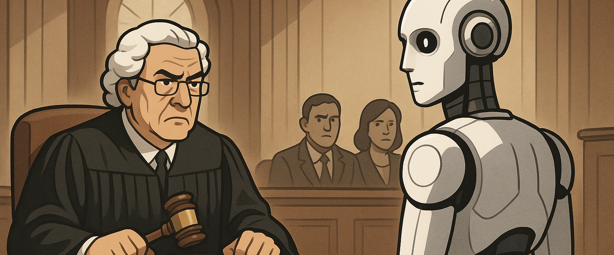

## Des typologies de responsabilités nouvelles

Dans le sillage des transformations sectorielles provoquées par l’IA, une reconfiguration silencieuse mais décisive est à l’œuvre : celle des typologies de mission et, avec elles, des chaînes de responsabilité. Autrefois clairement balisées entre celui qui conçoit, celui qui décide, celui qui exécute et celui qui rend compte, ces lignes s’estompent à mesure que l’intelligence artificielle prend en charge des pans entiers de l’action. Non pas seulement comme outil, mais comme entité active, autonome dans ses choix opérationnels, capable d’initiative, d’adaptation, voire de contournement.

L’évolution ne se limite plus à un simple déplacement de la “R” du RACI (réalisation) vers des modules numériques. Ce qui se joue désormais, c’est la tentation — ou l’illusion — d’un **transfert partiel de l’accountability elle-même** vers ces agents non humains. La ligne de front se déplace : face à une erreur d’exécution, un incident éthique ou un préjudice subi, la question se pose avec insistance — **à qui incombe la reddition des comptes** ? Et derrière cette question, une autre : qui est assurable ?

Ce mouvement rappelle, par analogie, celui qui a vu le passage d’une responsabilité individuelle à une responsabilité sociétale. L’entreprise, en tant que personne morale, endosse la sanction, l’amende, la charge de réparation. Les dirigeants, eux, bénéficient de polices spécifiques (D&O), qui protègent leur personne tout en séparant la logique de gestion de celle de la pénalité. Avec l’IA, une dynamique semblable semble émerger : l’IA réalise, parfois décide, mais c’est son détenteur, son concepteur, ou son utilisateur qui reste, dans l’ombre ou au grand jour, l’entité assurable.

Le glissement ne va pas sans tensions. L’IA n’est ni une personne, ni un employé, ni un prestataire. Elle échappe aux statuts classiques du droit du travail, de la sous-traitance, de la direction opérationnelle. Pourtant, elle agit. Et c’est cette action — souvent non scriptée, parfois imprévisible — qui produit des effets concrets, assurables ou non. Dès lors, **la mission n’est plus une ligne d’exécution, mais une forme de cohabitation entre une intention humaine et une agentivité artificielle**, avec tous les flous que cela suppose.

Pour l’assureur, pour le courtier, pour l’entreprise cliente, cela impose une relecture complète des typologies de mission : qui est censé faire ? qui est censé savoir ? qui est censé répondre de quoi ? Et surtout, **jusqu’où peut-on construire des couvertures sur des entités dont la responsabilité n’est pas reconnue, mais dont les effets sont bien réels ?**

Dans cette zone grise, la garantie ne peut plus reposer sur une logique d’imputabilité directe. Il faudra concevoir des couvertures qui tiennent compte des contextes d’usage, des chaînes de décision hybrides, et des zones d’indécision opérationnelle. Non pour absoudre l’humain, mais pour structurer, de manière assumée, un monde où l’acte n’est plus toujours signé, ni toujours su, mais n’en reste pas moins effectif.

À ce titre, les typologies de missions nouvelles ne sont pas seulement un catalogue d’activités émergentes. Elles sont le reflet d’un monde en transition, où la notion même de "mission" se réécrit sous influence algorithmique.
