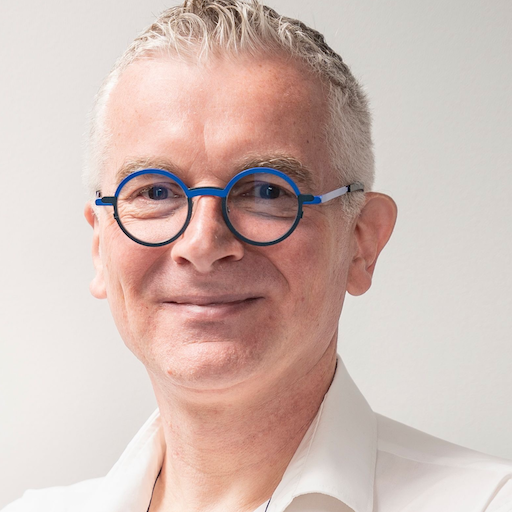

## Avertissement de l'auteur

<table>
<tr>
<td style="width: 160px; vertical-align: top; padding-right: 20px;">
  
</td>
<td style="vertical-align: top;">

Ce travail a été réalisé en toute humilité, par un spécialiste des risques cyber qui s’intéresse profondément à l’intelligence artificielle, aux sciences et à l’avenir des sociétés humaines. Il ne prétend pas à l’exhaustivité ni à la vérité absolue. Il s’inscrit dans une volonté sincère : <strong>clarifier les enjeux, structurer une pensée, partager des informations utiles</strong> à tous ceux qui devront, demain, composer avec l’IA.

Ce document a été <strong>co-écrit avec ChatGPT</strong>, que je considère ici comme <strong>“mon ami IA à moi”</strong>. Ce n’est pas un outil froid, mais un partenaire de réflexion, capable de reformuler, d’interroger, d’enrichir et parfois même de déstabiliser. Nous avons travaillé en binôme, dans une logique d’échange et d’itération constante. Le résultat est le fruit de cette collaboration : humaine, artificielle, assumée.

Ce texte est <strong>ouvert à la critique</strong> et à la contradiction. Il n’a pas été écrit pour enfermer une position, mais pour <strong>ouvrir des esprits</strong>, <strong>stimuler des débats</strong> et <strong>partager des angles de vue assurantiels et systémiques</strong> sur un sujet encore mouvant. Il s’adresse aux décideurs, aux assureurs, aux chercheurs, aux ingénieurs, aux juristes, et à toute personne concernée par le futur des intelligences non humaines.

Le document est proposé en <strong>open source</strong>. Il est librement accessible, réutilisable, transformable, tant que son esprit d’origine est respecté : celui d’une <strong>démarche volontaire, collaborative, éthique</strong>. Il est aussi conçu pour <strong>évoluer dans le temps</strong>, comme un <strong>document vivant</strong>, que les retours critiques, les contributions et les nouveaux événements viendront enrichir.

 
 
J’ai délibérément adopté une approche <strong>pluridisciplinaire</strong> : technique, éthique, juridique, assurantielle, stratégique. Car aucun de ces regards ne suffit seul. C’est à la croisée de ces champs que peuvent naître les réponses les plus responsables et les plus audacieuses.

Si vous souhaitez prolonger ce travail, contribuer à sa suite, ou simplement échanger, je vous invite à me contacter : 
📧 <strong>vincent.lagny@gmail.com</strong> 
🔗 <a href="http://linkedin.com/in/vincentlagny"><strong>linkedin.com/in/vincentlagny</strong></a>
 
 
<em><strong>Vincent Lagny</strong> est expert en cybersécurité, assurance des risques technologiques et gouvernance numérique. Il accompagne depuis plus de 30 ans les grandes organisations publiques et privées dans la maîtrise des systèmes critiques, l’évaluation des vulnérabilités complexes, et la conception de garanties innovantes face aux transformations numériques. Passionné par l’intelligence artificielle, il explore depuis plusieurs années les croisements entre IA, éthique, responsabilité et assurance, avec une approche systémique et prospective. Son ambition : <strong>mettre la technique au service d’un futur maîtrisé et partageable</strong>.</em>

</td>
</tr>
</table>

