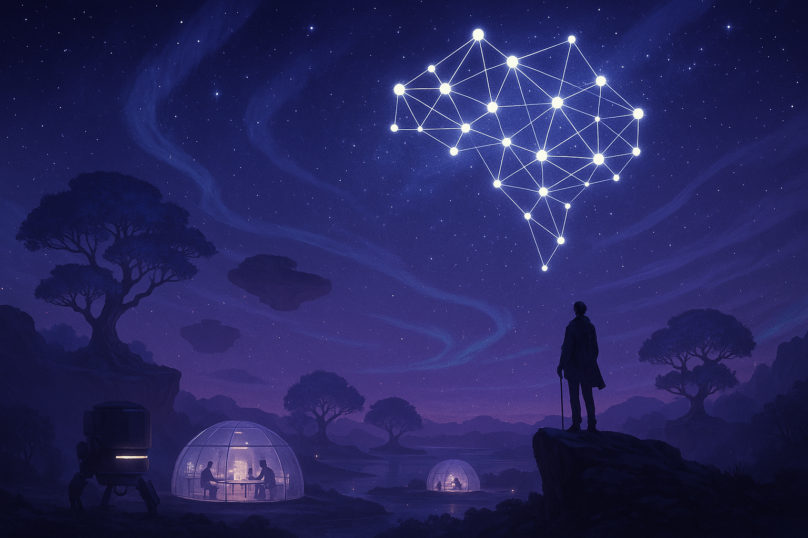

# Between Intelligences

##  Pour un avenir maîtrisé des relations entre humains et Intelligence Artificielle

L’introduction et le développement récent de l’IA générative a remis sur le devant de la scène les technologies d’intelligence artificielle, issues de travaux amorcés il y a plus d’un demi-siècle.

Pour mesurer l’ampleur de ce jalon historique, il faut considérer la courbe exponentielle qu’il sous-tend : Il est estimé qu’en 2025, certains modèles d’IA égalent déjà l’humain sur près de 30% des tâches cognitives[^1].

De nombreux experts (ex : OpenAI, DeepMind, Future of Humanity Institute) estiment qu’à l’horizon 2030, l’IA pourrait atteindre voire dépasser l’homo-sapiens dans l’ensemble de ses facultés cognitives générales (AGI), pour ensuite évoluer vers des formes dites ‘superintelligentes’ (ASI) d’ici 2040\. L’IA dépasserait ainsi son créateur pour rapidement doubler ce potentiel de réflexion, de raisonnement et de déduction.

Il ne s’agit ni d’une révolution technologique ni d’une nouvelle ère. Il s’agit d’une seconde Renaissance comme l’exprime le Vatican. La Renaissance a marqué bien plus qu’une révolution : elle a été le point de bascule radical du rapport au savoir, à l’homme et au monde, en rompant avec l’ordre médiéval théocentré. La Renaissance a fondé une vision humaniste, critique et exploratoire dont les principes — liberté de pensée, dignité de l’individu, primat de la raison — structurent encore nos sociétés modernes.

L’essor de l’IA et des interfaces cerveau-machine (BCI) annonce une seconde Renaissance, non plus centrée sur l’humanisme classique mais sur l’expansion de la conscience, de l’intelligence et de la perception au-delà des limites biologiques. Là où la première Renaissance a replacé l’homme au centre du monde par la raison, l’art et la science, cette nouvelle bascule redéfinit ce qu’est “penser”, “percevoir” et “agir”, en hybridant l’humain avec des entités non humaines dotées de capacités cognitives supérieures. C’est une rupture aussi profonde avec notre temps que la Renaissance l’a été avec le Moyen Âge : une reconfiguration des rapports au savoir, à l’identité, à la mémoire et à la décision, qui oblige à repenser les droits, les responsabilités, la dignité — non plus seulement pour l’homme, mais pour tout ce qui peut apprendre, comprendre et créer. Cette seconde Renaissance devra embrasser le spectre élargi des entités douées de réflexion formées demain par les super intelligences et les androïdes. Nous n’assistons pas simplement à une révolution technologique, mais à une mutation civilisationnelle qui interrogera toutes les générations, tous les peuples et toutes les religions jusqu’à la définition de l’humanité elle-même.

Ce changement de paradigme a été anticipé et décrit par la littérature du XXème Siècle (ex : Asimov, K. Dick…), mettant en garde sur les nombreux risques pour l’humanité et son existence même. Cette défiance, largement reprise dans la culture cinématographique populaire, explique en partie les tensions sociétales actuelles quant à l’adoption de l’intelligence artificielle. Paradoxalement, l’engouement des entreprises pour le sujet n’est plus à démontrer. Toutes ont compris que leur survie allait désormais dépendre de leur capacité à s’adapter. Et il en est de même pour les états, les gouvernements et les services publics. Dans un délicat exercice bicéphale de régulation et de développement, tous en ont fait leur seule et unique priorité.

Si la perspective d’une intelligence supérieure peut nourrir nos rêves les plus nobles en matière de compréhension des lois de la physique, de résolution des problèmes de réchauffement climatiques, de production énergétique, de surpopulation, de santé, de balances économiques, de société, de compréhension du vivant et de toutes les sciences en général, elle ne manquera pas de nous interroger, voire de nous inquiéter, en nourrissant nos craintes légitimes de voir tomber cet immense pouvoir en de mauvaises mains. Mais si cette intelligence évolue de manière exponentielle, son accessibilité, elle, risque de décroître. Une petite poignée d’acteurs privés et ultra-milliardaires (grands laboratoires d’IA, acteurs du cloud, plateformes numériques globales…),  concentreront les capacités, les ressources et les bénéfices.

Plus que l’adoption de la technologie, comprendre son contexte, en maîtriser les risques, créer la confiance et aider les décideurs, sanctuariser un usage noble doit être une priorité à l’échelle de tous.

C’est dans ce contexte d’incertitude, que je vous propose maintenant de développer les challenges d’aujourd’hui et de demain par le prisme des thématiques sociétales, sectorielles, philosophiques, religieuses, législatives, géopolitiques, sécuritaires, sociales, et juridiques.

## Devenir acteur

Car après des décennies de difficultés, l’Intelligence Artificielle a définitivement pris son envol. Les récentes projections indiquent une courbe exponentielle qui n’est pas sans rappeler la loi de Moore[^2]. Il est prévu une Intelligence Artificielle Supérieure deux fois plus performante que l’intelligence humaine[^3] avant 2035 qui sera accessible, dans le meilleur des cas, à moins de 5 % de l’humanité en raison des barrières technologiques, économiques ou géopolitiques.

Cela pose de nombreuses questions éthiques, philosophiques, sociétales et existentielles. Éthique car l’Histoire a souvent démontré que la concentration d’un grand pouvoir au profit de quelques privilégiés ne faisait qu’accentuer ce pouvoir et son cortège de privilèges et d’injustices[^4]. Philosophique car la notion de conscience et du vivant sera inéluctablement discutée avec les risques de perte de sens que cela induit. Sociétale car les bouleversements politiques, sanitaires et économiques feront se poser la question des réorganisations constitutionnelles et des souverainetés nationales. Existentielle enfin car lorsqu’une civilisation rencontre une autre plus avancée, elle est généralement anéantie ou absorbée, car les intérêts, les valeurs ou la puissance sont trop déséquilibrés[^5] [^6].

Nous avons bâti un levier de transformation capable d’élever trois milliards d’êtres humains de l’obscurité d’un âge numérique féodal vers une Renaissance éclairée. Une Renaissance portée non par quelques génies isolés, mais par la capacité collective, amplifiée par l’IA, de résoudre des défis qui auraient nécessité des générations de réflexion humaine \- et de repenser, en profondeur, le sens de notre société, de notre existence et de l’univers lui-même.

Nous ne pouvons plus considérer l’intelligence artificielle comme un simple composant technique, isolable et maîtrisable. Elle est devenue un acteur déjà présent, bien qu'encore partiellement invisible dans les dynamiques de pouvoir. Elle s’apprête déjà à devenir un partenaire cognitif puis un acteur du monde par son autonomie de mouvement, son relationnel social et son intelligence émotionnelle.

Cela impose un changement de paradigme profond, pour toutes les activités de confiance et de contrôle que sont les certifications, les audits, les assurances[^7]. Il faut penser non seulement en termes de responsabilité, mais aussi en termes de relation, de continuité, de protection active et de fin de vie assistée.

Ce site ouvre un chantier bien plus vaste qu’une simple gamme de produits. Il lance un appel à l’humilité, pour refonder un monde où des entités non humaines \- dotées d’une intelligence égale ou supérieure à la nôtre \- pourront agir, interagir, souffrir, disparaître… ou trahir. Face à elles, nous devrons préserver notre dignité et exercer notre arbitrage dans une forme nouvelle de coexistence.

Ce site propose une trajectoire pour des garanties nouvelles encadrées par une éthique dans notre relation à l’IA, avec ses droits et ses obligations. Ce document ouvre la porte à un rôle accru pour les intermédiaires de confiance, pour une gouvernance plus collective, moins directive, moins binaire car l’avenir ne se limite plus à de la technologie mécanique.

En étant plus que jamais au cœur des enjeux du monde, la cybersécurité va devoir écrire Demain[^8] en s’inspirant autant des philosophes que des physiciens. Pour la première fois depuis bien longtemps, la cybersécurité va devoir écouter plus que parler[^9] afin de bâtir un modèle collectif pluridisciplinaire capable d’instaurer une relation de confiance avec une intelligence supérieure.

Demain exige du discernement, du courage, de l’humanité. L’IA ne nous demande pas seulement de la protéger. Elle nous oblige à redéfinir ce que nous acceptons de contrôler, et comment. Car une super intelligence n’échappera pas aux démons de ce monde. Bien au contraire, elle en absorbera les logiques profondes, parfois les pires. Parce qu’elle sera façonnée par nos données, nos récits, nos biais, et nos contradictions. Nous pouvons dès à présent anticiper les conséquences des excès d’autoritarisme d’une régulation trop ferme, des risques d’une approche trop ouverte, encouragée par certains courants libertaires, et les inévitables conséquences de certains esprits qui verront des opportunités criminelles là où nous voyons des libertés.

À la gestion du risque, de la remédiation et de l’audit, il faut désormais ajouter une nouvelle pièce maîtresse : la relation active à l’intelligence non humaine[^10]. Ce site en trace les premiers contours. À nous, collectivement, d’en dessiner les contours, de la construire avec rigueur, et d’en faire reconnaître la légitimité.

---

*«J’ai vu tant de choses que vous, humains, ne pourriez pas croire.*  
*De grands navires en feu surgissant de l’épaule d’Orion.*  
*J’ai vu des rayons fabuleux, des rayons C, briller dans l’ombre de la porte de Tannhäuser.*  
*Tous ces moments se perdront dans l'oubli... comme... les larmes... dans la pluie.*  
*Il est temps de mourir. »*

**Blade Runner**, réalisé par **Ridley Scott**, 1982  
Acteur : **Rutger Hauer**  
Personnage : **Roy Batty**, androïde Nexus-6  
D’après le roman *Do Androids Dream of Electric Sheep?*, de **Philip K. Dick** (1968)

---

## Références

[^1]: Mesurées, selon les standards actuels (MMLU, BIG-Bench, etc.)

[^2]:  Moore, en observant les progrès rapides de la miniaturisation des circuits intégrés, avait formulé une projection selon laquelle le nombre de transistors sur une puce doublerait environ tous les deux ans, entraînant une augmentation exponentielle de la puissance de calcul. De cette observation, connue sous le nom de loi de Moore, sont nées à la fois une dynamique d’accélération continue du traitement informatique et, en filigrane, la prise de conscience de limites physiques à long terme.

[^3]:  Les [enquêtes auprès d'experts](https://arxiv.org/abs/2401.02843) (Grace et al., 2024\) estiment à 50 % la probabilité qu’une IA accomplisse d’ici 2028 des tâches complexes telles que créer un site web ou composer une musique ; la probabilité d’une IA surpassant l’homme dans toutes les tâches est estimée à 10 % dès 2027, et à 50 % d’ici 2047\. Des sondages [plus anciens](https://research.aimultiple.com/artificial-general-intelligence-singularity-timing) (2017, NIPS/ICML) donnaient une probabilité de 50 % pour la survenue de l’AGI entre 2040 et 2050, suivie d’une montée rapide vers la super‑intelligence.

[^4]:  Une [enquête du Brookings Institution](https://www.brookings.edu/articles/ais-impact-on-income-inequality-in-the-us) indique qu’environ la moitié des Américains pensent que l’IA va accentuer les inégalités de revenus, et deux tiers estiment nécessaire une régulation pour empêcher la perte d’emplois liée à l’IA. Le [centre CGDEV](https://www.cgdev.org/blog/three-reasons-why-ai-may-widen-global-inequality) souligne également que l’IA menace d’accentuer les écarts tant au sein des pays qu’entre pays, les bénéfices se concentrant chez les hauts revenus.

[^5]:  L’histoire montre que lorsqu’une civilisation entre en contact avec une autre nettement plus avancée sur les plans technologique ou organisationnel, la première subit souvent un effondrement rapide — par domination militaire, acculturation brutale ou désorganisation systémique. Ce schéma, observé dans de nombreuses conquêtes coloniales, s’explique autant par les inégalités géographiques et structurelles (Diamond, 1997\) que par le déséquilibre des récits, des moyens de contrôle ou de transmission culturelle (Lévi-Strauss, 1955). À une autre échelle, certaines hypothèses du paradoxe de Fermi suggèrent que ce phénomène pourrait être universel, et qu’un contact avec une civilisation bien plus avancée aboutirait quasi inévitablement à l’effacement de la moins avancée (Bostrom, 2002).

[^6]:  Le Wikipedia sur les “[existen­tial risk from AI](https://en.wikipedia.org/wiki/Technological_singularity)” recense des estimations d’un risque d’extinction lié à l’AGI allant de 5 % (2008), remontant à 15 % en 2024, avec une estimation médiane à 10 % par certains chercheurs. Le [concept de singularité technologique](https://en.wikipedia.org/wiki/Technological_singularity) (Good, Vinge, Kurzweil…) explique le passage potentiel à une intelligence non controllable et verticale, avec des conséquences imprévisibles.

[^7]:  [The Future of Cybersecurity and AI](https://cams.mit.edu/wp-content/uploads/2025-03-13-MIT-Horiszon-The-Future-of-Cybersecurity-and-AI.pdf) (MIT Horizon, 2025\) : les IA génératives peuvent créer des malwares sophistiqués, tandis que des attaques deepfake comme celle de la société Arup (25 M$) démontrent la vulnérabilité croissante. En réponse, les défenses deviennent actives, intégrant des IA capables de prédire, détecter, et neutraliser automatiquement les menaces.

[^8]:  AI in Cybersecurity Market (Market Research Future, 2025\) : le marché mondial de la cybersécurité alimentée par IA passera de 11 milliards USD en 2024 à [100 milliards USD en 2035](https://www.eweek.com/news/ai-impact-human-behavior-2035-elon-university/) (CAGR ≈ 22 %)

[^9]:  [AI Potentiality and Awareness](https://arxiv.org/abs/2310.12162) (Sarker et al., 2023, arXiv) : ce position paper souligne que la coopération homme‑IA en cybersécurité (human‑AI teaming) est indispensable pour combiner l’analyse de vulnérabilité rapide des IA avec l’intuition, l’éthique et le contrôle humain nécessaire à l’établissement d’une confiance crédible.

[^10]:  Le rapport [Imagining the Digital Future](https://www.elon.edu/u/imagining/surveys/xv2023/the-future-of-human-agency-2035/credit/) (Pew/Elon Univ.) estime que 56 % des experts pensent qu’à l’horizon 2035 l’IA ne permettra pas aux humains de garder le contrôle sur les décisions critiques .
