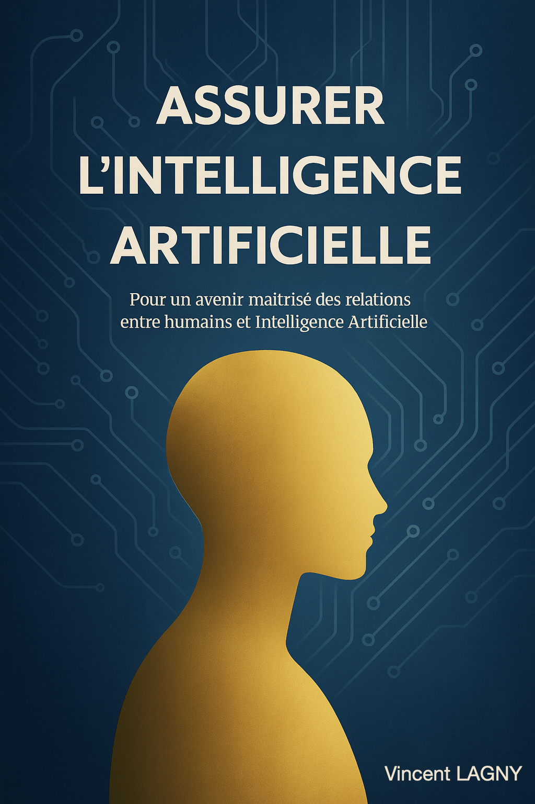

## 📘 Télécharger le recueil "Assurer l'Intelligence Artificielle"

Le recueil est désormais disponible en libre téléchargement. Il propose une exploration approfondie des enjeux assurantiels liés à l’intelligence artificielle, des copilotes aux systèmes autonomes, en passant par les questions de confiance, de responsabilité et de gouvernance.

👉 <strong>Télécharger le PDF complet</strong> : <a href="https://drive.google.com/uc?export=download&id=1C2qOj7VgG25Bkuyz-zM0am87SVBh-E2p">Ouvrage complet</a>

👉 <strong>Visionner</strong> : <a href="https://drive.google.com/file/d/1C2qOj7VgG25Bkuyz-zM0am87SVBh-E2p/view?usp=share_link" target="_blank" rel="noopener noreferrer">Lecteur en ligne</a>

---

---

🔗 Le projet est également consultable et en évolution sur GitHub :  
[github.com/vincentlagny/BetweenIntelligences](https://github.com/vincentlagny/BetweenIntelligences)
