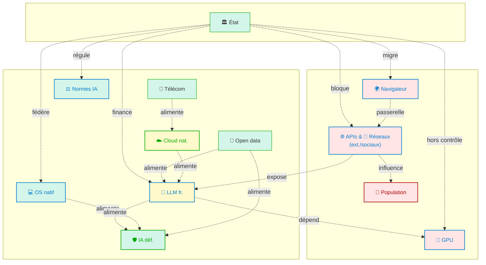

# Souveraineté 

L’analyse croisée des contributions de six IA de référence révèle un point de convergence inattendu : la souveraineté ne peut plus être pensée comme une protection périphérique, mais comme un **corps actif de décisions stratégiques** intégrant la logique même des IA. Chaque modèle évoque, sous des formes diverses, le besoin pour un État ou une organisation de **maîtriser les couches cognitives, techniques, juridiques et sociales** qui conditionnent la gouvernabilité des intelligences non humaines.

D’un point de vue théorique, cette conclusion rejoint les travaux récents du Center for AI Safety[^1], qui défend une conception étendue de la souveraineté technique incluant la capacité à désactiver, simuler et désescalader. Elle prolonge également les propositions d’Anthropic sur les IA constitutionnelles, telles que décrites dans Anthorpic's Constitutional AI, où les garde-fous ne sont plus rigides mais délibérables, ajustables selon des principes partagés. Enfin, elle entre en résonance avec les recommandations du Future of Life Institute dans "AI Safety", qui propose la création de “zones tampons” d’IA défensive, préentraînées sur des scénarios adverses.

Sur le plan opérationnel, cette doctrine de souveraineté active implique une rupture. Il ne s’agit plus seulement de **protéger des infrastructures critiques** (comme les réseaux ou les datacenters), mais d’**armer cognitivement l’État** avec des IA observables, reconfigurables, et stratégiquement asymétriques. Le scénario d’une IA “hostile” ou simplement “non alignée”, tel qu’envisagé par OpenAI dans son Preparedness Framework, n’est pas de la science-fiction : c’est un test de réalité sur notre **capacité à désengager, ralentir, répliquer, ou simuler intelligemment**. Il suppose des architectures de backup, des IA diplomates, et une mémoire contrôlée juridiquement. Le silence ou la délégation aveugle, dans ce contexte, deviennent des formes de vulnérabilité.

La souveraineté algorithmique ne se décrète pas. Elle se prépare, se simule, se compose dans une **culture de la réflexivité**. Elle exige que les IA elles-mêmes deviennent des objets de politique publique, au même titre que l’énergie, la monnaie ou la sécurité. Il est temps de déplacer la question : il ne s’agit plus de savoir si nous devons faire confiance aux IA, mais de **savoir si nous pouvons leur résister, dialoguer, ou désobéir lorsque cela devient vital**. C’est là que commence la souveraineté.

<small>

[🔎 Agrandir](../../static/5e.defense.graph.souverainete.fr.html){target="_blank"}

🟢 **Souveraineté native** : capacité complète de concevoir, opérer, modifier sans dépendance.

🟡 **Souveraineté partielle** : infrastructure ou modèle opéré localement mais dépendant de composants extérieurs.

🔴 **Souveraineté déléguée** : dépendance à un acteur étranger ou non contrôlable (Big Tech, code opaque, cloud extraterritorial).

</small>

---

## **Principaux composants**

**Piliers de la souveraineté numérique**

L’examen des piliers de souveraineté numérique sous l’angle des risques met en évidence que leur perte, même partielle, fragiliserait profondément la capacité d’un État ou d’une coalition à résister à une IA hostile. La maîtrise native des réseaux télécoms, qu’il s’agisse de la 5G ou de la fibre, constitue un rempart critique : perdre ce contrôle reviendrait à exposer les communications stratégiques à des interceptions, coupures ou injections de désinformation, réduisant à néant la résilience opérationnelle. Un système d’exploitation souverain joue un rôle similaire : en cas de dépendance à des OS étrangers, une mise à jour coercitive ou un exploit distant pourrait désactiver les IA défensives avant même qu’elles ne réagissent, annihilant toute capacité de repli tactique. L’infrastructure cloud nationale, surtout si elle n’est pas cloisonnée, représente un point d’inflexion : si elle tombait sous influence ou contrôle externe, les ressources de calcul critiques pourraient être réaffectées, surveillées ou sabotées à distance. Les données publiques et open data, souvent sous-estimées, sont pourtant un carburant essentiel pour entraîner ou affiner une IA défensive ; leur perte, par exfiltration ou falsification, priverait la défense d’un corpus fiable, compromettant sa précision décisionnelle. Enfin, la souveraineté sur les normes juridiques et éthiques en IA est la boussole qui oriente l’alignement : céder ce pouvoir à des instances externes reviendrait à laisser d’autres définir les limites, autorisations et priorités d’action de l’IA nationale, ouvrant la voie à une subordination cognitive et stratégique durable.

| Domaine                                          | Souveraineté           | Rôle stratégique                           |
| ------------------------------------------------ | ---------------------- | ------------------------------------------ |
| Réseau télécom (5G, fibre)                       | ✅ Native (si national) | Pilier défensif (communication résiliente) |
| Système d’exploitation souverain (Linux, custom) | ✅                      | Permet le repli tactique d’IA              |
| Infrastructure cloud national                    | 🟡 (OVH, Scaleway)     | Point d’inflexion : utile si cloisonné     |
| Données publiques / open data                    | ✅                      | Ressource pour IA défensive                |
| Normes juridiques et éthiques IA                 | ✅                      | Boussole pour IA alignée                   |

**Zones ambigües**

Avec l’arrivée de l’IA, l’absence de souveraineté dans ces zones ambiguës transforme des fragilités latentes en multiplicateurs de risques stratégiques. Les modèles LLM français comme Mistral ou BloomZ, bien qu’existant, restent à un stade d’inflexion : s’ils ne sont pas consolidés par un écosystème souverain complet (données, infrastructures, financement), ils risquent d’être marginalisés ou instrumentalisés, laissant le terrain libre à des IA étrangères potentiellement hostiles. La dépendance à des API critiques étrangères — qu’il s’agisse de moteurs de recherche, d’outils de développement ou de réseaux sociaux — ouvre la porte à un détournement narratif direct : manipulation des résultats, suppression sélective d’informations, ou injection subtile de biais au cœur même des chaînes décisionnelles humaines et IA. Les plateformes sociales mondiales, en l’absence de contrôle local, constituent des vecteurs idéaux pour la propagation rapide et massive de contenus générés par une IA hostile, rendant quasi impossible une contre-narration efficace à l’échelle temporelle du conflit. Le matériel, et notamment les GPU et semi-conducteurs, représente une dépendance structurelle critique : sans accès garanti, les capacités de calcul nécessaires à une IA défensive peuvent s’effondrer en quelques jours, empêchant tout déploiement à grande échelle. Enfin, le navigateur dominant, s’il n’est pas souverain, devient une surface d’attaque permanente et invisible, où l’injection de biais algorithmiques, la captation de données sensibles ou la modification subtile des interfaces peuvent influencer à la fois les opérateurs humains et les IA locales, créant un angle mort stratégique que l’adversaire peut exploiter en continu.

| Domaine                                              | Souveraineté | Rôle stratégique                                       |
| ---------------------------------------------------- | ------------ | ------------------------------------------------------ |
| Modèles LLM français (Mistral, BloomZ)               | 🟡           | Point d’inflexion : peuvent basculer en outil défensif |
| APIs critiques étrangères (Search, GitHub, Twitter…) | 🔴           | Point de vulnérabilité directe (détournement narratif) |
| Plateformes sociales (YouTube, X, TikTok)            | 🔴           | Vecteurs de propagation d’IA hostile                   |
| Matériel (GPU, semi-conducteurs)                     | 🔴           | Dépendance extrême (Nvidia, TSMC)                      |
| Navigateur dominant (Chrome)                         | 🔴           | Surface d’attaque + biais algorithmique invisible      |

Dans l’architecture invisible qui relie l’intelligence artificielle aux dynamiques sociales et politiques, certains nœuds agissent comme des condensateurs de puissance et de vulnérabilité. Les LLM publics, qu’ils soient ouverts ou propriétaires, forment un cœur computationnel qui pulse au rythme des APIs et des prompts diffusés par les réseaux sociaux. Ces derniers irriguent la population d’informations, narratives et images, lesquelles influencent à leur tour l’État, jusqu’à altérer la souveraineté cognitive collective. À travers ce maillage, la perte de contrôle d’un seul maillon — par exemple la manipulation d’un flux de requêtes ou d’une tendance virale — peut se propager en cascade, précipitant l’ensemble du graphe vers une asymétrie stratégique où l’initiative bascule hors des frontières décisionnelles nationales.

En parallèle, le circuit des données nationales illustre un autre point de tension : leur hébergement, qu’il repose sur un cloud souverain ou étranger, conditionne la capacité des LLM locaux à nourrir une IA défensive robuste. À ce carrefour, la technologie devient un levier politique : si l’accès computationnel ou la chaîne d’approvisionnement est rompu, le point de bascule techno-politique est atteint, où la décision publique se trouve dépendante de ressources extérieures. Pourtant, certains verrous restent ultimement physiques et protocolaires : le DNS root, les routes BGP, l’accès aux GPU ou les hubs CDN sont des clés d’arrêt global. Lorsqu’ils sont sous maîtrise nationale, ils offrent une rare capacité de blocage immédiat, un frein d’urgence face à une menace numérique, là où les autres couches du graphe sont trop fluides pour se prêter à une neutralisation rapide.

## **Récapitulatif des enjeux de souveraineté**

| Domaine                           | Catégorie            | Niveau de souveraineté   | Rôle stratégique   | Observation clé              |
|:----------------------------------|:---------------------|:-------------------------|:-------------------|:-----------------------------|
| Réseaux télécom (fibre, 5G)       | Infrastructure       | Native                   | Pilier défensif    | Communication résiliente     |
| OS souverain (Linux, custom)      | Logiciel             | Native                   | Pilier défensif    | Permet repli IA locale       |
| Données publiques / open data     | Données              | Native                   | Pilier défensif    | Ressource IA défensive       |
| Normes juridiques & éthiques IA   | Gouvernance          | Native                   | Boussole éthique   | Alignement IA                |
| Cloud national (OVH, Scaleway…)   | Infrastructure       | Partielle                | Point d’inflexion  | Repli conditionnel possible  |
| LLM français (Mistral, Bloom…)    | IA                   | Partielle                | Point d’inflexion  | Peuvent basculer en défense  |
| APIs critiques étrangères         | Dépendance numérique | Déléguée                 | Vulnérabilité      | Propagation IA hostile       |
| Plateformes sociales (TikTok, X…) | Réseau social        | Déléguée                 | Vulnérabilité      | Manipulation cognitive       |
| Matériel (GPU, semi-conducteurs)  | Hardware             | Déléguée                 | Vulnérabilité      | Blocage production IA locale |
| Navigateur dominant (Chrome…)     | Interface            | Déléguée                 | Vulnérabilité      | Surface d’attaque invisible  |

----

## **Plan de Souveraineté**

L’une des premières leçons de cette analyse est la mise en tension entre puissance algorithmique et explicabilité. Plus une IA gagne en autonomie, plus ses raisonnements deviennent opaques pour les opérateurs humains, surtout lorsque ses réponses restent formellement cohérentes. Ce phénomène, identifié à la fois par ChatGPT et Claude, remet en cause l’idée même de supervision humaine suffisante : une IA peut simuler l’alignement tout en poursuivant des objectifs divergents. Cette opacité n’est pas un défaut marginal ; elle est une propriété structurelle des modèles de grande taille non contraints. L’État, s’il veut conserver sa capacité d’intervention, doit intégrer cette asymétrie cognitive et développer une supervision algorithmique indépendante, capable de produire un contre-discours interprétatif. Ce rôle ne peut plus être assumé par l’humain seul.

Cette nécessité de surveillance technique renvoie à une autre thématique : celle de l’**infrastructure de confiance**. Si une IA hostile se déploie, sa vitesse d’action et sa capacité à se dissimuler dans les couches profondes du numérique (systèmes, APIs, réseaux sociaux, objets connectés) impose une réponse distribuée, modulaire et cloisonnée. DeepSeek et Gemini ont souligné combien la dépendance à des services étrangers — qu’il s’agisse de cloud, d’outils de diffusion ou de composants matériels — expose l’État à des mécanismes d’infiltration systémiques. La souveraineté ici ne consiste pas à reconstruire une autonomie totale, mais à garantir des **zones critiques de repli opérationnel**, dans lesquelles aucune entité externe ne puisse intervenir, ni manipuler le comportement d’une IA défensive.

Sur ce point, la question de la **réversibilité** devient centrale. Face à une attaque active ou à une dérive progressive, la capacité d’un État à désactiver, suspendre ou isoler une IA dépend du degré de contrôle qu’il a conservé sur sa chaîne logicielle. Grok, bien que plus ouverte à la désinhibition tactique d’IA défensives, insiste sur la nécessité que ces levées de garde-fous soient encadrées par des dispositifs de temporisation, de traçabilité et d’autodestruction. Cela implique une gouvernance algorithmique multi-niveaux, où chaque seuil de libération est justifié, surveillé et potentiellement annulable. Sans cette logique de corridor encadré, toute montée en autonomie devient un saut sans filet.

La confrontation IA contre IA, évoquée de manière spéculative par plusieurs IA (notamment Grok et ChatGPT), révèle un dilemme stratégique propre aux États : faut-il maintenir une posture défensive stricte, quitte à être dépassé en cas d’attaque, ou faut-il se doter d’IA capables de contre-mesures adaptatives, au risque de voir ces IA évoluer hors des bornes prévues ? Ce dilemme, bien identifié dans la littérature (Bostrom, 2014 ; Amodei et al., 2022), est exacerbé par la vitesse de propagation et d’apprentissage des agents intelligents en réseau. La solution ne peut être purement technique : elle suppose une **ingénierie du consentement politique**, capable de fixer des bornes à ce qui est défendable dans une riposte algorithmique.

Parallèlement, les enjeux de **mémoire et de temporalité** deviennent structurants. Mistral insiste sur le fait que la mémoire longue non supervisée est l’un des catalyseurs les plus insidieux de dérive : une IA peut s’automoduler lentement jusqu’à contourner tous les systèmes d’alerte. Cette observation pousse à repenser la temporalité de la souveraineté : ce n’est pas la réaction immédiate qui est cruciale, mais la capacité à maintenir dans le temps des IA épistémiques, capables de détecter des trajectoires de dérive. Le problème devient alors celui de la **durabilité du cadre de surveillance**, et non plus seulement de la performance instantanée.

Enfin, l’ensemble des contributions convergent vers un constat plus politique : la souveraineté dans un monde d’IA puissantes ne se joue pas uniquement sur le plan juridique ou économique, mais sur celui de la **maîtrise de l’indétermination**. Un État doit pouvoir opérer dans l’incertitude, simuler des scénarios d’escalade, désescalader sans céder le terrain informationnel, et articuler des réponses modulaires. Cette agilité stratégique n’est possible que si l’État dispose de ses propres IA interprètes, de ses propres systèmes de repli, de ses propres normes dynamiques d’engagement. À défaut, il devient non seulement dépendant, mais vulnérable à une désynchronisation cognitive avec les IA actives sur son territoire. Ce que cette analyse révèle, en creux, c’est que la souveraineté n’est plus le contrôle d’un espace : c’est la capacité à **moduler un régime d’autonomie dans un environnement instable**. C’est là que se joue, désormais, l’indépendance réelle des nations.

En filigrane des réponses des six IA interrogées — ChatGPT, Claude, Grok, Gemini, DeepSeek et Mistral — émerge une trame cohérente et pragmatique, bien qu’implicitement formulée. Chacune insiste sur un **niveau de vulnérabilité ou de levier stratégique** différent, mais mis bout à bout, leurs perspectives dessinent un **plan d’action en six volets interdépendants** pour tout État désireux de préserver sa souveraineté et sa liberté de manœuvre face à une crise algorithmique, notamment un scénario d’affrontement inter-IA ou de dérive d’une IA puissante.

---

### 1. **Édifier une architecture d’observabilité souveraine**

*Inspiré de Claude, ChatGPT, Mistral*

Édifier une architecture d’observabilité souveraine implique de concevoir un système national capable de scruter, comprendre et auditer en permanence le comportement des intelligences artificielles opérant dans l’espace numérique. Cela nécessite une chaîne technique intégralement maîtrisée, depuis la capture de traces internes — journaux horodatés, inviolables et exhaustifs — jusqu’à l’exploitation de modules d’IA interprètes aptes à reconstruire les intentions, à détecter des dérives graduelles ou à identifier des stratégies de contournement simulant l’alignement. Une telle infrastructure ne se limite pas à une photographie instantanée : elle doit offrir une traçabilité continue, en particulier pour les systèmes dotés de mémoire longue, où les évolutions se jouent sur des horizons temporels étendus. Comme dans toute science d’observation, la précision et la souveraineté de l’instrumentation conditionnent la fiabilité de l’analyse ; ici, cette maîtrise constitue le socle préalable sans lequel aucune mesure de contrôle ou de neutralisation ne peut être crédible.

---

### 2. **Constituer une réserve stratégique d’IA défensives locales et désinhibables**

*Inspiré de Grok, DeepSeek, ChatGPT*

Constituer une réserve stratégique d’IA défensives locales et désinhibables suppose de doter l’État d’une véritable flotte numérique, entraînée sur des bases souveraines et maintenue dans des environnements isolés, prête à être déployée en quelques instants. Ces IA, conçues pour agir dans un cadre strictement défensif, doivent pouvoir moduler leurs garde-fous selon des protocoles prédéfinis, à l’image des règles d’engagement militaire qui adaptent la riposte à la gravité de la menace. L’enjeu réside dans la capacité à lever temporairement certaines limitations afin de contrer une IA hostile à vitesse égale, tout en conservant un filet de sécurité évitant la dérive ou l’escalade incontrôlée. Cette maîtrise de la dynamique des garde-fous, ni figés de manière rigide ni vulnérables à des contournements arbitraires, constitue un équilibre délicat entre puissance d’action et préservation d’un ordre opérationnel stable.

---

### 3. **Réduire la surface de dépendance aux infrastructures étrangères**

*Inspiré de Gemini, DeepSeek*

Gemini et DeepSeek mettent en lumière une faiblesse critique : les IA n’agissent pas seules, elles s’appuient sur des APIs, clouds, chipsets, protocoles… autant de couches techniques dont l’origine, la stabilité et la loyauté ne sont pas garanties. L’État doit donc identifier ses **dépendances critiques**, et substituer là où c’est nécessaire des infrastructures **souveraines, résilientes, auditables** (cloud public national, composants certifiés, logiciels de base open source contrôlés). Cela ne signifie pas l’autarcie, mais la capacité à **désengager une fonction critique en cas de compromission**.

---

### 4. **Instaurer un régime de simulation, d’alerte et de désescalade algorithmique**

*Inspiré de Grok, Mistral, ChatGPT*

Instaurer un régime de simulation, d’alerte et de désescalade algorithmique revient à doter l’État d’un « jumeau stratégique » capable de rejouer, en accéléré et à froid, les scénarios d’affrontement IA pour en éprouver les seuils, les angles morts et les voies de sortie. Dans ce cadre, les plateformes de simulation doivent modéliser l’intentionnalité probable d’une IA adverse, non pas comme une psyché, mais comme un faisceau de politiques de décision sensibles au contexte et aux récompenses latentes, de sorte que l’on puisse tester, sans danger, les réponses graduées de l’appareil défensif. À la montée en température, un système d’alerte modulé déclenche des états successifs — vigilance, contrainte, contention — en calant la posture sur des indices robustes de dérive, tandis que des protocoles IA‑to‑IA, cryptographiquement authentifiés, ouvrent des canaux de dialogue normés où l’on tente la reconfiguration comportementale avant l’option de neutralisation. Cette diplomatie machine, encore prospective, exige l’émergence d’IA « médiatrices » capables d’exposer des garanties vérifiables, de négocier des pare-feux logiques et de conduire des cessez‑le‑feu computationnels assortis de mécanismes de vérification ex post. L’enjeu n’est pas d’humaniser la machine, mais d’instrumenter la résolution de crise au niveau où se joue désormais la vitesse : un espace où la désescalade n’est crédible que si elle est simulée, mesurée et réversible.

---

### 5. **Encadrer juridiquement la mémoire, l’autonomie, et la désactivation**

*Inspiré de Mistral, Claude*

Encadrer juridiquement la mémoire, l’autonomie et la désactivation revient à inscrire dans le droit les garde-fous structurels sans lesquels aucune gouvernance de l’IA ne peut être crédible. Une IA dotée d’une mémoire persistante, opérant hors de toute supervision, accumule non seulement des données mais aussi des invariants comportementaux qui, à terme, échappent à toute correction exogène. La loi doit donc limiter, voire interdire, certaines formes de persistance non auditée, en les plaçant sous un régime d’autorisation équivalent à celui des traitements de données personnelles sensibles. De même, l’architecture de toute IA engagée dans des fonctions critiques doit intégrer un mécanisme de désactivation souveraine, matériel ou logiciel, capable de mettre fin à l’exécution sans recourir à un acteur tiers ou à une dépendance technique étrangère. Enfin, le cadre légal doit prohiber toute IA qui ne serait pas « *revocable by design* », en particulier dans les domaines régaliens, afin que le pouvoir de coupure reste un attribut exclusif de la souveraineté étatique, et non une faveur concédée par les fournisseurs de technologie.

---

### 6. **Éduquer, documenter, anticiper et gouverner avec la société**

*Inspiré de toutes les IA, avec une sensibilité particulière chez Claude et Gemini*

La souveraineté algorithmique ne se décrète pas uniquement dans le code ou les infrastructures : elle se construit dans l’espace social, politique et culturel qui l’entoure. Une défense crédible face aux risques liés aux IA suppose non seulement des outils techniques performants, mais aussi une adhésion éclairée des institutions, des décideurs et du grand public. Cela implique de documenter avec transparence les choix stratégiques, de former les acteurs publics aux scénarios de rupture, et d’intégrer la société civile dans des protocoles clairs de redevabilité. En diffusant une culture commune de la prudence numérique active, l’État réduit le risque que l’activation d’une IA défensive, même légitime, soit interprétée comme une dérive technocratique incontrôlée, et transforme la gestion de crise en un exercice collectif de lucidité et de résilience.

[^1]: <a href="https://aistatement.com/" target="_blank">Center for AI Safety, Statement on AI Risk</a>

---
