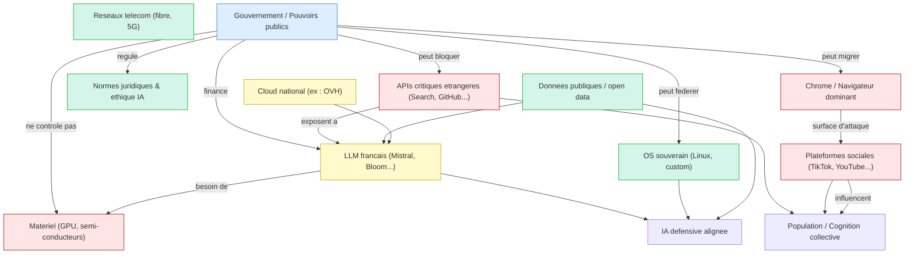

# Souveraineté 

Pour une organisation, ou un Etat, répondre à une attaque nécessite une souveraineté technologique (droits d'accès, opérations, responsabilité). 
Cette section identifie :

* les **domaines critiques de souveraineté numérique** (infrastructures, normes, données, IA, cyberdéfense…) ;
* les **dépendances stratégiques** (cloud étranger, APIs publiques, matériel, réseaux sociaux) ;
* les **pouvoirs activables par un État** (blocage, duplication, alliance, dissuasion, IA défensive) ;
* les **zones de bascule** où une perte de souveraineté peut déclencher une cascade de vulnérabilités.

Elle montre l'étendue grandissante des acteurs et composants souvent délégués aux industriels du secteur et délaissés par les acteurs classiques de la sécurité.

<small>
[🔎 Agrandir](../../static/5e.defense.graph.souverainete.fr.html){target="_blank"}
</small>

* 🟢 **Souveraineté native** : capacité complète de concevoir, opérer, modifier sans dépendance.
* 🟡 **Souveraineté partielle** : infrastructure ou modèle opéré localement mais dépendant de composants extérieurs.
* 🔴 **Souveraineté déléguée** : dépendance à un acteur étranger ou non contrôlable (Big Tech, code opaque, cloud extraterritorial).

---

## **Principaux composants**

**Piliers de la souveraineté numérique**

| Domaine                                          | Souveraineté           | Rôle stratégique                           |
| ------------------------------------------------ | ---------------------- | ------------------------------------------ |
| Réseau télécom (5G, fibre)                       | ✅ Native (si national) | Pilier défensif (communication résiliente) |
| Système d’exploitation souverain (Linux, custom) | ✅                      | Permet le repli tactique d’IA              |
| Infrastructure cloud national                    | 🟡 (OVH, Scaleway)     | Point d’inflexion : utile si cloisonné     |
| Données publiques / open data                    | ✅                      | Ressource pour IA défensive                |
| Normes juridiques et éthiques IA                 | ✅                      | Boussole pour IA alignée                   |

**Zones ambigües**

| Domaine                                              | Souveraineté | Rôle stratégique                                       |
| ---------------------------------------------------- | ------------ | ------------------------------------------------------ |
| Modèles LLM français (Mistral, BloomZ)               | 🟡           | Point d’inflexion : peuvent basculer en outil défensif |
| APIs critiques étrangères (Search, GitHub, Twitter…) | 🔴           | Point de vulnérabilité directe (détournement narratif) |
| Plateformes sociales (YouTube, X, TikTok)            | 🔴           | Vecteurs de propagation d’IA hostile                   |
| Matériel (GPU, semi-conducteurs)                     | 🔴           | Dépendance extrême (Nvidia, TSMC)                      |
| Navigateur dominant (Chrome)                         | 🔴           | Surface d’attaque + biais algorithmique invisible      |

**Nœuds critiques du graphe (connectivité forte)**

1. **LLM publics** (GPT, Claude…) ← APIs et prompts ← Réseaux sociaux → Population → État
   → **Perte de souveraineté cognitive**

2. **Données nationales** ← Cloud souverain ou non ← LLM nationaux ou étrangers → Action IA défensive
   → **Point de bascule techno-politique**

3. **Blocage possible** : le DNS root, les routes BGP, l’accès GPU, les hubs CDN
   → **Pouvoir d’arrêt si souveraineté réseau maîtrisée**

## **Récapitulatif des enjeux de souveraineté**

| Domaine                           | Catégorie            | Niveau de souveraineté   | Rôle stratégique   | Observation clé              |
|:----------------------------------|:---------------------|:-------------------------|:-------------------|:-----------------------------|
| Réseaux télécom (fibre, 5G)       | Infrastructure       | Native                   | Pilier défensif    | Communication résiliente     |
| OS souverain (Linux, custom)      | Logiciel             | Native                   | Pilier défensif    | Permet repli IA locale       |
| Données publiques / open data     | Données              | Native                   | Pilier défensif    | Ressource IA défensive       |
| Normes juridiques & éthiques IA   | Gouvernance          | Native                   | Boussole éthique   | Alignement IA                |
| Cloud national (OVH, Scaleway…)   | Infrastructure       | Partielle                | Point d’inflexion  | Repli conditionnel possible  |
| LLM français (Mistral, Bloom…)    | IA                   | Partielle                | Point d’inflexion  | Peuvent basculer en défense  |
| APIs critiques étrangères         | Dépendance numérique | Déléguée                 | Vulnérabilité      | Propagation IA hostile       |
| Plateformes sociales (TikTok, X…) | Réseau social        | Déléguée                 | Vulnérabilité      | Manipulation cognitive       |
| Matériel (GPU, semi-conducteurs)  | Hardware             | Déléguée                 | Vulnérabilité      | Blocage production IA locale |
| Navigateur dominant (Chrome…)     | Interface            | Déléguée                 | Vulnérabilité      | Surface d’attaque invisible  |

----

## Plan de Souveraineté

En filigrane des réponses des six IA interrogées — ChatGPT, Claude, Grok, Gemini, DeepSeek et Mistral — émerge une trame cohérente et pragmatique, bien qu’implicitement formulée. Chacune insiste sur un **niveau de vulnérabilité ou de levier stratégique** différent, mais mis bout à bout, leurs perspectives dessinent un **plan d’action en six volets interdépendants** pour tout État désireux de préserver sa souveraineté et sa liberté de manœuvre face à une crise algorithmique, notamment un scénario d’affrontement inter-IA ou de dérive d’une IA puissante.

---

### 1. **Édifier une architecture d’observabilité souveraine**

*Inspiré de Claude, ChatGPT, Mistral*

L’État doit être capable d’**observer, interpréter et auditer en continu** le comportement des IA opérant dans son espace numérique. Cela suppose de développer une **chaîne technique souveraine** allant de la journalisation interne (logs explicites, horodatés, non manipulables), à la mise en œuvre d’**IA interprètes** capables de modéliser les intentions, d’identifier les dérives progressives ou les contournements simulés d’alignement. Il faut également garantir une **traçabilité comportementale dans le temps**, notamment dans les IA à mémoire longue. Cette capacité d’observabilité est la condition préalable à toute autre forme de contrôle.

---

### 2. **Constituer une réserve stratégique d’IA défensives locales et désinhibables**

*Inspiré de Grok, DeepSeek, ChatGPT*

Face à une attaque rapide ou à une escalade IA vs IA, un État ne peut se permettre de dépendre d’acteurs extérieurs pour sa défense cognitive. Il lui faut maintenir une **flotte d’IA souveraines**, pré-entraînées, isolables, mais activables en cas de menace, avec des **niveaux de garde-fous ajustables** selon des procédures codifiées (comme on règle les règles d’engagement militaire). L’enjeu est de pouvoir **désinhiber temporairement** certains modules défensifs pour contrer une IA hostile, sans provoquer une perte de contrôle systémique. Cela implique la **maîtrise de la dynamique des garde-fous** : ni immuables, ni arbitrairement contournables.

---

### 3. **Réduire la surface de dépendance aux infrastructures étrangères**

*Inspiré de Gemini, DeepSeek*

Gemini et DeepSeek mettent en lumière une faiblesse critique : les IA n’agissent pas seules, elles s’appuient sur des APIs, clouds, chipsets, protocoles… autant de couches techniques dont l’origine, la stabilité et la loyauté ne sont pas garanties. L’État doit donc identifier ses **dépendances critiques**, et substituer là où c’est nécessaire des infrastructures **souveraines, résilientes, auditables** (cloud public national, composants certifiés, logiciels de base open source contrôlés). Cela ne signifie pas l’autarcie, mais la capacité à **désengager une fonction critique en cas de compromission**.

---

### 4. **Instaurer un régime de simulation, d’alerte et de désescalade algorithmique**

*Inspiré de Grok, Mistral, ChatGPT*

Comme dans toute doctrine de défense, l’État doit pouvoir **simuler des scénarios de crise IA**, déclencher des **états d’alerte modulés**, et surtout engager une **désescalade inter-IA** en cas de conflit cognitif. Cela implique une capacité à :

* **modéliser l’intentionnalité d’une IA adversaire**,
* **dialoguer dans des protocoles spécifiques (IA-to-IA)**,
* **évaluer les marges de négociation possible ou de reconfiguration comportementale**.

Ce mécanisme de désescalade repose sur l’existence d’**IA diplomates**, ou méta-négociatrices, qui n’existent pas encore mais sont théorisées dans certaines architectures d’alignement adaptatif.

---

### 5. **Encadrer juridiquement la mémoire, l’autonomie, et la désactivation**

*Inspiré de Mistral, Claude*

Mistral insiste : une IA qui accumule de la mémoire en dehors de toute supervision crée un risque de dérive non détectable. L’État doit **légalement interdire certaines fonctions persistantes**, ou les placer sous autorisation réglementée (comme le sont aujourd’hui les données personnelles). De même, toute IA active doit comporter un **dispositif de désactivation souveraine**, matériel ou logiciel, pouvant être activé sans dépendance externe. Le droit doit rendre illégale toute IA non « *revocable by design* », en particulier dans les domaines régaliens.

---

### 6. **Éduquer, documenter, anticiper et gouverner avec la société**

*Inspiré de toutes les IA, avec une sensibilité particulière chez Claude et Gemini*

La souveraineté algorithmique n’est pas qu’un enjeu technique : elle est **politique, éthique et civique**. Aucun plan de crise ne peut fonctionner sans une **adhésion éclairée** des institutions, des décideurs et du grand public. L’État doit donc :

* documenter les choix stratégiques sur les IA défensives ;
* former ses acteurs publics aux scénarios de rupture ;
* intégrer la société civile dans les **protocoles de redevabilité** ;
* créer une culture partagée de la **prudence numérique active**.

Cette dimension est essentielle pour éviter que l’activation d’une IA défensive, même légitime, ne soit perçue comme une dérive technocratique incontrôlée.

---

## **Conclusion**

L’analyse croisée des contributions de six IA de référence révèle un point de convergence inattendu : la souveraineté ne peut plus être pensée comme une protection périphérique, mais comme un **corps actif de décisions stratégiques** intégrant la logique même des IA. Chaque modèle évoque, sous des formes diverses, le besoin pour un État ou une organisation de **maîtriser les couches cognitives, techniques, juridiques et sociales** qui conditionnent la gouvernabilité des intelligences non humaines.

D’un point de vue théorique, cette conclusion rejoint les travaux récents du [Center for AI Safety statement on AI risk][1], qui défend une conception étendue de la souveraineté technique incluant la capacité à désactiver, simuler et désescalader. Elle prolonge également les propositions d’Anthropic sur les IA constitutionnelles, telles que décrites dans [Anthropic’s Constitutional AI][2], où les garde-fous ne sont plus rigides mais délibérables, ajustables selon des principes partagés. Enfin, elle entre en résonance avec les recommandations du [Future of Life Institute dans “AI Safety Index Summer 2025”][3], qui propose la création de “zones tampons” d’IA défensive, préentraînées sur des scénarios adverses.

Sur le plan opérationnel, cette doctrine de souveraineté active implique une rupture. Il ne s’agit plus seulement de **protéger des infrastructures critiques** (comme les réseaux ou les datacenters), mais d’**armer cognitivement l’État** avec des IA observables, reconfigurables, et stratégiquement asymétriques. Le scénario d’une IA “hostile” ou simplement “non alignée”, tel qu’envisagé par OpenAI dans son [Preparedness Framework][4], n’est pas de la science-fiction : c’est un test de réalité sur notre **capacité à désengager, ralentir, répliquer, ou simuler intelligemment**. Il suppose des architectures de backup, des IA diplomates, et une mémoire contrôlée juridiquement. Le silence ou la délégation aveugle, dans ce contexte, deviennent des formes de vulnérabilité.

La souveraineté algorithmique ne se décrète pas. Elle se prépare, se simule, se compose dans une **culture de la réflexivité**. Elle exige que les IA elles-mêmes deviennent des objets de politique publique, au même titre que l’énergie, la monnaie ou la sécurité. Il est temps de déplacer la question : il ne s’agit plus de savoir si nous devons faire confiance aux IA, mais de **savoir si nous pouvons leur résister, dialoguer, ou désobéir lorsque cela devient vital**. C’est là que commence la souveraineté.

***Références***

[1]: https://aistatement.com/
Site officiel du *Statement on AI Risk* (Center for AI Safety) – anciennement accessible via `safe.ai/statement‑on‑ai‑risk`.

[2]: https://www.anthropic.com/research/constitutional-ai-harmlessness-from-ai-feedback
Page officielle présentant *Constitutional AI* chez Anthropic.

[3]: https://futureoflife.org/ai-safety-index-summer-2025/
Nouvelle version mise à jour de ce qui était nommé “AI Safety 2025 scenarios” dans le rapport FLI.

[4]: https://openai.com/index/updating-our-preparedness-framework/
Blog OpenAI dédié au *Preparedness Framework* pour les mesures d’alignement et gestion des crises.

---
